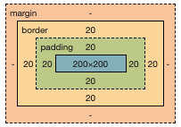
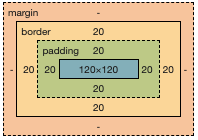

# box-sizing : content-box, border-box;

- content-box : 초기 값

  - width와 height 속성이 콘텐츠 영역만 포함하고 안팎 여백과 테두리는 포함하지 않는다

```css
div {
  width: 200px;
  height: 200px;
  padding: 20px;
  border: 20px solid black;
}
```



box-sizing을 설정하지 않았을 때, 박스의 가로, 세로 길이는 **지정해 준 200px에 border : 20px에 padding : 20px을 더한** 240px이 된다.

<hr>

- border-box : width 와 height 속성이 안쪽 여백과 테두리는 포함하고, 바깥 여백은 포함하지 않음

```css
div {
  box-sizing: border-box;
  width: 200px;
  height: 200px;
  padding: 20px;
  border: 20px solid black;
}
```



box-sizing: border-box;로 설정하면 **div 박스 자체의 크기는 변하지 않고** padding: 20px과 bordxer: 20px이 박스 가로, 세로 200px 안에 포함된다.
