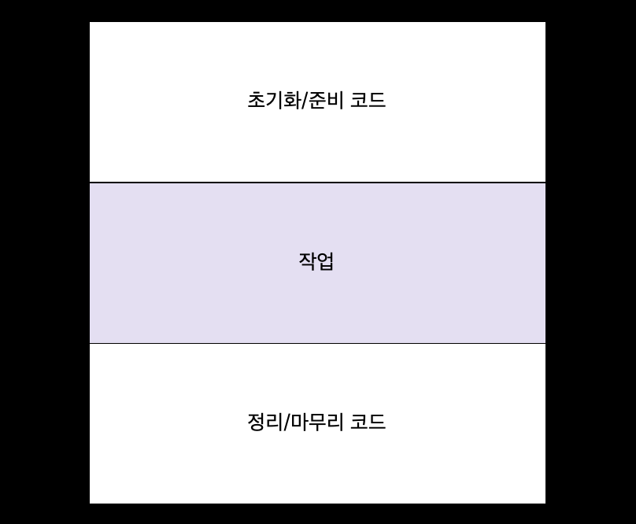

# 람다 표현식

- `람다 표현식` : 메서드로 전달할 수 있는 익명 함수를 단순화한 것
  - 특정 클래스에 종속되지 않으므로 함수라고 부른다
  - 람다 표현식을 메서드 인수로 전달하거나 변수로 저장할 수 있다


<br />

# Where? & How?

- 함수형 인터페이스를 기대하는 곳에서만 람다 표현식을 사용 할 수 있다
  - `함수형 인터페이스` : 정확히 하나의 추상 메서드를 지정하는 인터페이스

## java.util.function 함수형 인터페이스

### `Predicate`

- test : 제네릭 형식 T의 객체를 인수로 받아 불리언을 반환

```java
// 함수형 인터페이스
@FunctionalInterface
public interface Predicate<T> {
    boolean test(T t);
}

// 함수형 인터페이스를 매개변수로 받는 메서드
public <T> List<T> filter(List<T> list, Predicate<T> p) {
    List<T> result = new ArrayList<>();
    for (T t: list) {
        if(p.test(t)) {
            result.add(t);
        }
    }
    return result;
}

// 람다 전달
filter(numbers, (Integer num) -> num % 2 == 0);
```

### `Consumer`

- accept : 제네릭 형식 T 객체를 인수로 받아서 void를 반환

```java
// 함수형 인터페이스
@FunctionalInterface
public interface Consumer<T> {
    void accept(T t);
}

// 함수형 인터페이스를 매개변수로 받는 메서드
public <T> void forEach(List<T> list, Consumer<T> c) {
    for(T t: list) {
        c.accept(t);
    }
}

// 람다 전달
forEach(numbers, (Integer num) -> System.out.println("number: " + num));
```

### `Function`

- apply : 제네릭 형식 T를 인수로 받아서 제네릭 형식 R 객체를 반환

```java
// 함수형 인터페이스
@FunctionalInterface
public interface Function<T, R> {
    R apply(T t);
}

// 함수형 인터페이스를 매개변수로 받는 메서드
public <T, R> List<R> map(List<T> list, Function<T, R> f) {
    List<R> result = new ArrayList<>();
    for (T t: list) {
        result.add(f.apply(t));
    }
    return result;
}

// 람다 전달
map(names, (String s) -> s.length());
```

<br />

---

<br />

- `기본형 특화` : 기본형을 입출력으로 사용하는 상황에서 오토박싱 동작을 피할 수 있도록한 버전의 함수형 인터페이스

  - `박싱` : 기본형(int, double, byte, char) ➡️ 참조형(Integer, Object, List, Byte) 변환
  - `언박싱` : 참조형 ➡️ 기본형 변환
  - `오토박싱` : 박싱, 언박싱이 자동으로 이루어짐

- `함수 디스크립터` : 함수형 인터페이스의 추상 메서드 시그니처
  - 함수형 인터페이스 메서드의 시그니처와 일치하는 람다를 전달할 수 있음

| 함수형 인터페이스   | 함수 디스크립터   | 기본형 특화                                                                                                                                                                                                                                                 |
| ------------------- | ----------------- | ----------------------------------------------------------------------------------------------------------------------------------------------------------------------------------------------------------------------------------------------------------- |
| Predicate<T>        | T -> boolean      | IntPredicate, LongPredicate, DoublePredicate                                                                                                                                                                                                                |
| Consumer<T>         | T -> void         | IntConsumer, LongConsumer, DoubleConsumer                                                                                                                                                                                                                   |
| Function<T, R>      | T -> R            | IntFunction<R>, IntToDoubleFunction, IntToLongFunction, <br />LongFuncstion<R>, LongToDoubleFuncsiont,LongToIntFunction, <br />DoubleFunction<R>, DoubleToIntFunction, DoubleToLongFunction, <br />ToIntFunction<T>, ToDoubleFunction<T>, ToLongFunction<T> |
| Supplier<T>         | () -> T           | BooleanSupplier, IntSupplier, LongSupplier, DoubleSupplier                                                                                                                                                                                                  |
| UnaryOperator<T>    | T -> T            | IntUnaryOperator, LongUnaryOperator, DoubleUnaryOperator                                                                                                                                                                                                    |
| BinaryOperator<T>   | (T, T) -> T       | IntBinaryOperator, LongBinaryOperator, DoubleBinaryOperator                                                                                                                                                                                                 |
| BiPredicate<L, R>   | (T, U) -> boolean |                                                                                                                                                                                                                                                             |
| BiCounsumer<T, U>   | (T, U) -> void    | ObjIntConsumer<T>, ObjLongConsumer<T>, ObjDoubleConsumer<T>                                                                                                                                                                                                 |
| BiFunction<T, U, R> | (T, U) -> R       | ToIntBiFunction<T, U>, ToLongBiFunction<T, U>, ToDoubleBiFunction<T, U>                                                                                                                                                                                     |

<br />

---

<br />

- `@FunctionalInterface` 어노테이션
  - 실제로 함수형 인터페이스가 아니면 컴파일러가 에러를 발생시킴

<div align="center">


</div>

### 활용 예시

```java
public static void process(Runnable r) {
    r.run();
}

process(() -> System.out.println("Hello World!")); // Hello World!가 출력된다
```

## 유용한 람다 활용 예제 : `실행 어라운드 패턴`

- `실행 어라운드 패턴` : 실제 자원을 처리하는 코드를 설정과 정리 두 과정이 둘러싸는 형태

<div align="center">



</div>

```java
public String processFile() throws IOException {
    try (BufferedReader br = new BufferedReader(new FileReader("data.txt"))) {
        return br.readLine(); // 작업
    }
}
```

`1` 시그니처와 일치하는 함수형 인터페이스 만들기

- BufferedReader -> String
- throw IOException

```java
@FunctionalInterface
public interface BufferedReaderProcessor {
    String process(BufferedReader b) throws IOException;
}
```

`2` 파라미터로 전달할 수 있도록 수정

```java
public String processFile(BufferedReaderProcessor p) throws IOException {
    try (BufferedReader br = new BufferedReader(new FileReader("data.txt"))) {
        return p.process(br);
    }
}
```

`3` 람다 활용

```java
processFile((BufferedReader br) -> br.readLine() + br.readLine());
```

# 형식 검사, 형식 추론, 제약

## 형식 검사

```java
filter(inventory, (Apple apple) -> apple.getWeight() > 150);
```

1. filter 메서드의 선언을 확인한다.
2. filter 메서드는 두 번째 파라미터로 Predicate\<Apple> 형식(대상 형식)을 기대한다.
   - `대상 형식` : 어떤 콘텍스트에서 기대되는 람다 표현식의 형식
3. Predicate\<Apple>은 test라는 한 개의 추상 메서드를 정의하는 함수형 인터페이스다.
4. test 메서드는 Apple을 받아 boolean을 반환하는 함수 디스크립터를 묘사한다.
5. filter 메서드로 전달된 인수는 이와 같은 요구사항을 만족해야 한다.

### void 호환 규칙

- 람다의 바디에 일반 표현식이 있으면 void를 반환하는 함수 디스크립터와 호환된다

```java
// add는 boolean을 반환하지만 T -> void로 호환 가능
Consumer<String> b = s -> list.add(s)
```

## 형식 추론

- 자바 컴파일러는 람다 표현식이 사용된 콘텍스트(대상 형식)를 이용해서 람다 표현식과 관련된 함수형 인터페이스를 추론한다.
  - 대상 형식을 이용해서 함수 디스크립터를 알 수 있음
  - ➡️ 람다 시그니처 추론 가능
  - 람다 표현식의 파라미터 형식에 접근 가능
  - ➡️ 람다 문법에서 `파라미터 형식 생략 가능`

```java
filter(apples, (apple) -> Color.RED.equals(apple.getColor()));
```

## 지역 변수 사용 - `람다 캡처링`

- `람다 캡처링` : `자유 변수`(파라미터로 넘겨진 변수가 아닌 외부에서 정의된 변수) 활용 가능
- `지역 변수`
  - 명시적으로 final 선언되어 있거나
  - 실질적으로 final로 선언된 변수와 똑같이 사용되어야 함

```java
int portNumber = 1337;
Runnable r = () -> System.out.println(portNumber); // 캡처 불가능
portNumber = 31337;
```

- 지역 변수는 스택에 위치
- 변수 할당이 해제되었는데도 람다를 실행하는 스레드에서 해당 변수에 접근하려 할 수 있음
- ➡️ 자유 지역 변수의 **복사본** 제공 : 복사본의 값이 바뀌지 않아야 하므로 지역 변수에는 한 번만 값을 할당해야 한다

## 메서드 참조

- 특정 람다식을 축약한 것 : 가독성 ✨

```java
s -> s.length()
String::length // 메서드 참조

num -> System.out.println(num)
System.out::println // 메서드 참조
```

1. `정적 메서드` 참조(static)
   ```java
   s -> Integer.parseInt(s)
   Integer::parseInt // 메서드 참조
   ```
2. `다양한 형식`의 `인스턴스 메서드` 참조
   ```java
   apple -> apple.getWeight()
   Apple::getWeight // 메서드 참조
   ```
3. `기존 객체`의 `인스턴스 메서드` 참조
   ```java
   color -> pallet.isRedColor(color)
   pallet::isRedColor // 메서드 참조
   ```

## 생성자 참조

```java
ClassName::new

weight -> new Apple(weight)
Apple::new // 생성자 참조

BiFunction<Color, Integer, Apple> biFunctionTest = (color, weight) -> new Apple(color, weight);
BiFunction<Color, Integer, Apple> biFunctionTest = Apple::new; // 생성자 참조
```

# 람다 표현식을 조합할 수 있는 유용한 메서드

- `디폴트 메서드`

## Comparator 조합

```java
Comparator<Apple> c = Comparator.comparing(Apple::getWeight);
```

### `역정렬`

- reverse 디폴트 메서드
  ```java
  apples.sort(Comparator.comparing(Apple::getWeight).reversed());
  ```

### Comperator 연결

- 두 번째 조건 추가 : thenComparing

```java
apples.sort(Comparator.comparing(Apple::getWeight)
        .reversed()
        .thenComparing(Apple::getCountry)); // 연결
```

## Predicate 조합

### `negate` : 특정 프레디케이트를 반전

```java
Predicate<Apple> redApple = apple -> Color.RED.equals(apple.getColor());
Predicate<Apple> notRedApple = redApple.negate();
```

### `and` : 두 람다 and 조합

```java
// 빨간색이면서 무거운 사과
Predicate<Apple> redAndHeavyApple = redApple.and(apple -> apple.getWeight() > 150);
```

### `or` : 두 람다 or 조합

```java
// 빨간색이면서 무거운 사과 or 녹색 사과
Predicate<Apple> redAndHeavyAppleOrGreen = redApple.and(apple -> apple.getWeight() > 150)
        .or(apple -> Color.GREEN.equals(apple.getColor()));
```

## Function 조합

### `andThen` : 주어진 함수를 적용한 결과를 다른 함수의 입력으로 전달하는 함수로 변환

```java
Function<Integer, Integer> add = x -> x + 1;
Function<Integer, Integer> multiply = x -> x * 2;
// x + 1을 multiply의 x로 전달 => (x + 1) * 2
Function<Integer, Integer> addAndThenMultiply = add.andThen(multiply);
```

### `compose` : 인수로 주어진 함수를 먼저 실행한 다음에 그 결과를 외부 함수의 인수로 제공

```java
Function<Integer, Integer> add = x -> x + 1;
Function<Integer, Integer> multiply = x -> x * 2;
// multiply를 먼저 계산하고 그 결과가 add의 인자가 됨 => add(x * 2)
Function<Integer, Integer> addComposeMultiply = add.compose(multiply);
```
