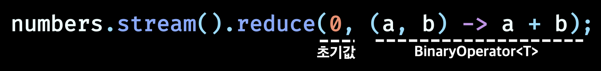

# 스트림 활용

|     |                                                                 |
| :-: | --------------------------------------------------------------- |
| `1` | [필터링](#필터링)                                               |
| `2` | [스트림 슬라이싱](#스트림-슬라이싱)                             |
| `3` | [매핑](#매핑)                                                   |
| `4` | [검색과 매칭](#검색과-매칭)                                     |
| `5` | [리듀싱](#리듀싱)                                               |
| `6` | [숫자형 스트림](#숫자형-스트림)                                 |
| `7` | [다양한 방식으로 스트림 만들기](#다양한-방식으로-스트림-만들기) |

---

- 데이터를 어떻게 처리할지는 스트림 API가 관리하므로 편리하게 데이터 관련 작업을 할 수 있다

# 필터링

## 프레디케이트로 필터링

- `filter`
  - 프레디케이트(불리언을 반환하는 함수)를 인수로 받아 프레디케이트와 일치하는 모든 요소를 포함하는 스트림을 반환

```java
menu.stream()
    .filter(dish -> dish.getCalories() > 300)
    .toList();
```

## 고유 요소 필터링

- `disctinct`
  - 고유 요소로 이루어진 스트림을 반환(중복 제거)
  - 고유 여부 : hashCode, equals로 결정

```java
List<Integer> numbers = List.of(1, 2, 1, 3, 3, 2, 4);
List<Integer> uniqueNumbers = numbers.stream()
        .distinct()
        .toList(); // 1, 2, 3, 4
```

# 스트림 슬라이싱

- 스트림 요소를 선택하거나 스킵하는 방법

## 프레디케이트 슬라이싱

- `takeWhile` : 프레디케이트가 true인 동안 반복 ➡️ false가 되는 순간 반복 작업을 중단
- `dropWhile` : ↔️ takeWhile / 프레디케이트가 false가 되면 작업을 중단하고 남은 요소를 모두 반환

```java
// specialMenu는 칼로리 순서로 정렬된 리스트
List<Dish> specialMenu = List.of(
        new Dish("seasonal fruit", true, 120, Type.OTHER),
        new Dish("prawns", false, 300, Type.FISH),
        new Dish("rice", true, 350, Type.OTHER),
        new Dish("chicken", false, 400, Type.MEAT),
        new Dish("french fries", true, 530, Type.OTHER)
);

// takeWhile
List<Dish> takeWhileTest = specialMenu.stream()
        .takeWhile(dish -> dish.getCalories() < 320)
        .toList(); // 320보다 칼로리가 낮은 요리들만 필터링됨
        // [seasonal fruit, prawns]

// dropWhile
List<Dish> dropWhileTest = specialMenu.stream()
        .dropWhile(dish -> dish.getCalories() < 320)
        .toList();
        // [rice, chicken, french fries]
```

## 스트림 축소

- `limit(n)` : 주어진 값 이하의 크기를 갖는 새로운 스트림 반환

```java
List<Dish> limitTest = specialMenu.stream()
        .filter(dish -> dish.getCalories() > 300)
        .limit(3)
        .toList();
        // [rice, chicken, french fries]
```

## 요소 건너뛰기

- `skip(n)` : 처음 n개 요소를 제외한 스트림 반환
  - n개 이하의 요소를 포함하는 스트림에 skip(n)을 호출하면 빈 스트림이 반환

```java
List<Dish> skipTest = specialMenu.stream()
        .filter(dish -> dish.getCalories() > 300)
        .skip(2)
        .toList(); // [french fries]
```

# 매핑

## 스트림의 각 요소에 함수 적용하기

- `map` : 함수를 인수로 받음 / 제공된 함수는 각 요소에 적용되며 함수를 적용한 결과가 새로운 요소로 매핑됨

```java
List<String> dishNames = menu.stream()
        .map(Dish::getName) // 각 dish의 요리명 추출
        .toList();
```

### map chaining

```java
List<Integer> dishNameLengths = menu.stream()
        .map(Dish::getName)
        .map(String::length) // 요리명의 길이 매핑
        .toList();
```

## 스트림 평면화

- `flatMap` : 스트림의 각 값을 다른 스트림으로 만든 다음 모든 스트림을 하나의 스트림으로 연결

```java
List<String> words = List.of("Modern", "Java", "In", "Action");
List<String> uniqueCharacters = words.stream()
        .map(word -> word.split("")) // 각 단어가 문자열 배열로 변환됨 Stream<String[]>{"M", "o", "d"...}...
        .flatMap(Arrays::stream) // 생성된 스트림을 하나의 스트림으로 평면화 Stream<String>
        .distinct()
        .toList(); // [M, o, d, e, r, n, J, a, v, I, A, c, t, i]
```

# 검색과 매칭

- 특정 속성이 데이터 집합에 있는지 여부를 검색

## 프레디케이트가 적어도 한 요소와 일치하는지 확인

- `anyMatch` : 프레디케이트가 주어진 스트림에서 적어도 한 요소와 일치하는지 확인

```java
if (menu.stream().anyMatch(Dish::isVegetarian)) {
    System.out.println("vegetarian 요리🍳가 준비되어 있습니다.👩‍🍳");
}
```

## 프레디케이트가 모든 요소와 일치하는지 검사

- `allMatch` : 스트림의 모든 요소가 주어진 프레디케이트와 일치하는지 검사

```java
List<Dish> meatOnly = List.of(new Dish("pork", false, 800, Type.MEAT),
        new Dish("beef", false, 700, Type.MEAT),
        new Dish("chicken", false, 400, Type.MEAT));

if (meatOnly.stream().allMatch(Dish::isMeat)) {
    System.out.println("고기 요리만 있음! 🍖");
}
```

- `noneMatch` : ↔️ allMatch / 주어진 프레디케이트와 일치하는 요소가 없는지 확인

## 요소 검색

- `findAny` : 현재 스트림에서 임의의 요소를 반환 / 다른 스트림연산과 연결해서 사용할 수 있음
  - 결과를 찾는 즉시 실행을 종료

```java
// findAny는 아무 요소도 반환하지 않을 수 있음
menu.stream()
        .filter(Dish::isVegetarian)
        .findAny() // Optional<Dish> 반환
        .ifPresent(dish -> System.out.println(dish.getName()));
        // ifPresent : 값이 있으면 출력, 없으면 아무 일도 일어나지 않음
        // 참고) isPresent : 값이 있으면 true 반환, 없으면 false 반환
```

## 첫 번째 요소 찾기

- `findFirst` : 스트림에서 첫 번째 요소 찾기

```java
List<Integer> someNumbers = List.of(1, 2, 3, 4, 5);
Optional<Integer> firstDivisibleByThree = someNumbers.stream()
        .filter(n -> n % 3 == 0)
        .findFirst(); // 3
```

# 리듀싱(`reduce`)

- 모든 스트림 요소를 처리해서 값으로 도출하는 작업

## 요소의 합

```java
List<Integer> numbers = List.of(1, 2, 3, 4, 5);

int sum = 0;
for (int num: numbers) {
    sum += num;
}

int sum = numbers.stream().reduce(0, (a, b) -> a + b);

// 메서드 참조
int sum = numbers.stream().reduce(0, Integer::sum);
```

<div align="center">



</div>

- 초기 값이 없으면 Optional 객체를 반환한다

## 최댓값과 최솟값

```java
int max = numbers.stream().reduce(0, Integer::max);
int min = numbers.stream().reduce(987654321, Integer::min);
```

# 숫자형 스트림

```java
int sum = numbers.stream().reduce(0, Integer::sum);
// 합계를 계산하기 전에 Integer를 기본형으로 언박싱 해야 함
```

## 기본형 특화 스트림

- `IntStream`, `DoubleStream`, `LongStream`
- 자주 사용하는 숫자 관련 리듀싱 연산 수행 메서드를 제공
- 필요할 때 다시 객체 스트림으로 복원하는 기능 제공
- 박싱 과정에서 일어나는 효율성과 관련 있으며 스트림에 추가 기능을 제공하지는 않음

### 숫자 스트림으로 매핑

- 특화 스트림으로 변환 : `mapToInt`, `mapToDouble`, `mapToLong`

```java
int calories = menu.stream()
        .mapToInt(Dish::getCalories) // IntStream으로 변환(❌ Stream<Integer>)
        .sum(); // IntStream 인터페이스에서 제공하는 메서드
        // 스트림이 비어있으면 기본값 0을 반환
```

### 객체 스트림으로 복원

- `boxed`

```java
IntStream intStream = menu.stream()
        .mapToInt(Dish::getCalories);
Stream<Integer> stream = intStream.boxed();
```

### 기본값 : OptionalInt

- Optional을 Integer, String 등의 참조 형식으로 파라미터화
- `OptionalInt`, `OptionalDouble`, `OptionalLong`

```java
// max의 경우 초기 값을 0으로 설정할 수 없기 때문에 값이 존재하는지 여부를 가리킬 수 있는 컨테이너 클래스 Optional 사용
OptionalInt maxCalories = menu.stream()
        .mapToInt(Dish::getCalories)
        .max();
```

```java
// 기본 최대값 명시적으로 적용
int maxCalories = menu.stream()
        .mapToInt(Dish::getCalories)
        .max()
        .orElse(500);
```

## 숫자 범위

- `range`, `rangeClosed`
  - 첫 번째 인수 : 시작값
  - 두 번째 인수 : 종료값
  - `range` : 시작값과 종료값이 결과에 포함되지 않음
  - `rangeClosed` : 시작값과 종료값이 결과에 `포함`

```java
IntStream evenNumbers = IntStream.rangeClosed(1, 100)
        .filter(n -> n % 2 == 0);
```

# 다양한 방식으로 스트림 만들기

## 값으로 스트림 만들기

- `Stream.of`

```java
Stream<String> stream = Stream.of("Modern", "Java", "In", "Action");
stream.map(String::toUpperCase)
        .forEach(System.out::println);
```

## null이 될 수 있는 객체로 스트림 만들기

- `Stream.ofNullable`

```java
Stream<String> values = Stream.of("config", "home", "user")
        .flatMap(key -> Stream.ofNullable(System.getProperty(key)));
```

## 배열로 스트림 만들기

- `Arrays.stream`

```java
int[] numbers = {1, 2, 3, 4, 5};
int sum = Arrays.stream(numbers).sum(); // 기본형 int 배열 ➡️ IntStream으로 변환
```

## 파일로 스트림 만들기

- `java.nio.file.Files`의 많은 정적 메서드가 스트림을 반환

## 함수로 무한 스트림 만들기

- `Stream.iterate`, `Stream.generate`
- 보통 무한한 값을 출력하지 않도록 `limit(n)` 함수를 연결해서 사용
- 무한 스트림의 요소는 무한적으로 계산이 반복되므로 정렬하거나 리듀스 할 수 없다

### `iterate`

- 기존 결과에 의존해서 순차적으로 연산 수행
- `언바운드 스트림`
- `연속된` 일련의 값을 만들 때 사용

```java
Stream.iterate(초기값, 람다식(이전값 -> 다음값))
```

```java
Stream.iterate(0, n -> n + 2)
        .limit(10)
        .forEach(System.out::println);
```

- `프레디 케이트 지원`

```java
Stream.iterate(초기값, 프레디케이트, 람다식(이전값 -> 다음값))
```

```java
IntStream.iterate(0, n -> n < 100, n -> n +4)
        .forEach(System.out::println);
```

### `generate`

- Supplier\<T>를 인수로 받아서 새로운 값을 생성
- limit가 없다면 스트림은 `언바운드 상태`가 됨

```java
Stream.generate(Math::random)
        .limit(5)
        .forEach(System.out::println);
```
