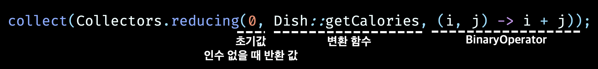

# 스트림으로 데이터 수집

<div align="center">

> 스트림은 데이터 집합을 멋지게 처리하는 게으른 반복자 😎

</div>

- `중간 연산`
  - 한 스트림을 다른 스트림으로 변환하는 연산
  - 여러 연산을 연결
  - 스트림 파이프라인 구성
  - 스트림의 요소를 소비하지 않는다
- `최종 연산`
  - 스트림의 요소를 소비해서 최종 결과를 도출
  - 스트림 파이프라인을 최적화하면서 계산 과정을 짧게 생략

# 컬렉터❓

- Collector 인터페이스 구현은 스트림의 요소를 어떤 식으로 도출할지 지정한다

## 고급 리듀싱 기능을 수행하는 컬렉터

-`collect`에서는 리듀싱 연산을 이용해서 스트림의 각 요소를 방문하면서 컬렉터가 작업을 처리한다

- `리듀싱 연산` : 컬렉션의 원소들을 결합하여 단일 결과값을 얻는 연산

```java
List<Transaction> transactions = transactionStream.collect(Collectors.toList());
```

# 리듀싱과 요약

- 스트림의 항목을 컬렉션으로 재구성 = 스트림의 모든 항목을 하나로 하 ㅂ칠 수 있다
- `counting()` : 항목의 개수 계산

```java
long howManyDishes = menu.stream().collect(Collectors.counting());
long howManyDishes = menu.stream().count();
```

## 스트림값에서 최댓값과 최솟값 검색

- `Collectors.maxBy`, `Collectors.minBy`
  - 스트림의 요소를 비교하는 데 사용할 Comparator를 인수로 받음

```java
Comparator<Dish> dishCaloriesComparator = Comparator.comparingInt(Dish::getCalories);
Optional<Dish> mostCalorieDish = menu.stream()
        .collect(Collectors.maxBy(dishCaloriesComparator));
```

## 요약 연산

- 스트림에 있는 객체의 숫자 필드의 합계나 평균 등을 반환하는 연산
- `Collectors.summingInt`
  - 객체를 int로 매핑하는 함수를 인수로 받는다

```java
int totalCalories = menu.stream()
        .collect(Collectors.summingInt(Dish::getCalories));
```

- `Collectors.summingLong`, `summingDouble`
- `Collectors.averagingInt`, `averagingLong`, `averagingDouble`
  - avaragingInt
    - 매핑된 프로퍼티가 int 형식일 때 사용
    - 반환 값은 double
    - 내부적으로 int 형식의 프로퍼티를 double로 변환하여 계산
  - averagingDouble
    - 매핑된 프로퍼티가 이미 double 형식이거나 int 등 다양한 형식일 때 사용
    - 반환 값은 double
    - 내부적으로 double 형식의 프로퍼티를 그다로 사용하여 계산

```java
double avgCalories = menu.stream()
        .collect(Collectors.averagingInt(Dish::getCalories));
```

- `summarizingInt`, `summarizingLong`, `summarizingDouble`
  - 두 개 이상의 연산을 한 번에 수행

```java
IntSummaryStatistics menuStatistics = menu.stream()
        .collect(Collectors.summarizingInt(Dish::getCalories));
// IntSummaryStatistics{count=9, sum=4200, min=120, average=466.666667, max=800}
```

## 문자열 연결

- `joining`
  - 스트림의 각 객체에 추출한 모든 문자열을 하나의 문자열로 연결해서 반환
  - 내부적으로 StringBuilder를 이용해서 문자열을 하나로 만듦

```java
String shortMenu = menu.stream()
        .map(Dish::getName)
        .collect(Collectors.joining(", "));
```

## 범용 리듀싱 요약 연산

- `Collectors.reducing`
  - 위의 일들을 다 할 수 있음
  - 특화된 컬렉터 사용한 이유❓ 프로그래밍적 편의성, 가독성

```java
// 범용 리듀싱 요약 연산을 이용하여 총 칼로리 계산
int totalCalories = menu.stream()
        .collect(Collectors.reducing(0, Dish::getCalories, (i, j) -> i + j));
```



### collect vs reduce

- `collect` : 도출하려는 결과를 누적하는 컨테이너를 바꾸도록 설계
- `reduce` : 두 값을 하나로 도출하는 불변형 연산
- 가변 컨테이너 관련 작업이면서 병렬성을 확보하려면 collect 메서드로 리듀싱 연산을 구현하는 것이 바람직

### 자신의 상황에 맞는 최적의 해법 선택

- 스트림 인터페이스에서 직접 제공하는 메서드를 이용하는 것에 비해 컬렉터를 이용하는 코드가 복잡하다
- 코드가 좀 더 복잡한 대신 재사용성과 커스터마이즈 가능성을 제공하는 높은 수준의 추상화와 일반화를 얻을 수 있다

# 그룹화

- 데이터 집합을 하나 이상의 특성으로 분류해서 그룹화
- `Collectors.groupingBy` : 인수로 **분류 함수**(스트림을 그룹화하는 기준)를 받는다

```java
Map<Type, List<Dish>> dishesByType = menu.stream()
        .collect(Collectors.groupingBy(Dish::getType));
// {MEAT=[pork, beef, chicken], FISH=[prawns, salmon], OTHER=[french fries, rice, season fruit, pizza]}

// 람다식 전달 가능
Map<CaloricLevel, List<Dish>> dishesByCaloricLevel = menu.stream()
        .collect(Collectors.groupingBy(dish -> {
            if (dish.getCalories() <= 400) return CaloricLevel.DIET;
            else if (dish.getCalories() <= 700) return CaloricLevel.NORMAL;
            else return CaloricLevel.FAT;
        }));
// {FAT=[pork], NORMAL=[beef, french fries, pizza, salmon], DIET=[chicken, rice, season fruit, prawns]}
```

## 그룹화된 요소 조작

- 그룹화한 다음 각 그룹의 요소를 조작하는 연산

```java
Map<Type, List<Dish>> caloricDishesByType = menu.stream()
        .collect(Collectors.groupingBy(Dish::getType,
                Collectors.filtering(dish -> dish.getCalories() > 500, // 필터링
                Collectors.toList())));
```

- `mapping`

```java
Map<Type, List<String>> dishNamesByType = menu.stream()
        .collect(Collectors.groupingBy(Dish::getType, Collectors.mapping(Dish::getName, Collectors.toList()))); // 각 Dish에 name을 매핑하고 list 생성
// {MEAT=[pork, beef, chicken], FISH=[prawns, salmon], OTHER=[french fries, rice, season fruit, pizza]}
```

- `flatMapping`
  - 두 수준의 리스트를 한 수준으로 평면화

```java
Map<String, List<String>> dishTags = new HashMap<>();
dishTags.put("pork", List.of("greasy", "salty"));
dishTags.put("beef", List.of("salty", "roasted"));
dishTags.put("chicken", List.of("fried", "crisp"));
dishTags.put("french fries", List.of("greasy", "fried"));
dishTags.put("rice", List.of("light", "natural"));
dishTags.put("season fruit", List.of("fresh", "natural"));
dishTags.put("pizza", List.of("tasty", "salty"));
dishTags.put("prawns", List.of("tasty", "roasted"));
dishTags.put("salmon", List.of("delicious", "fresh"));

Map<Type, Set<String>> dishNamesByType = menu.stream()
        .collect(Collectors.groupingBy(Dish::getType,
                Collectors.flatMapping(dish -> dishTags.get(dish.getName()).stream(), Collectors.toSet())));
// {MEAT=[salty, greasy, roasted, fried, crisp], FISH=[roasted, tasty, fresh, delicious], OTHER=[salty, greasy, natural, light, tasty, fresh, fried]}
```

## 다수준 그룹화

- `Collectors.groupingBy`
  - 내부 groupingBy를 전달해서 두 수준으로 스트림의 항목을 그룹화

```java
Map<Type, Map<CaloricLevel, List<Dish>>> dishesByTypeCaloricLevel = menu.stream()
        .collect(Collectors.groupingBy(Dish::getType, // 외부 Map
                Collectors.groupingBy(dish -> {
                    if (dish.getCalories() <= 400) {
                        return CaloricLevel.DIET;
                    } else if (dish.getCalories() <= 700) {
                        return CaloricLevel.NORMAL;
                    } else {
                        return CaloricLevel.FAT;
                    }
                })));
// {MEAT={FAT=[pork], NORMAL=[beef], DIET=[chicken]},
// FISH={NORMAL=[salmon], DIET=[prawns]},
// OTHER={NORMAL=[french fries, pizza], DIET=[rice, season fruit]}}
System.out.println(dishesByTypeCaloricLevel);
```

## 서브그룹으로 데이터 수집

```java
        Map<Type, Long> typesCount = menu.stream()
                .collect(Collectors.groupingBy(Dish::getType, Collectors.counting()));
                // 두 번째 인수로 counting 컬렉터 전달
        // {MEAT=3, FISH=2, OTHER=4}
```

- 분류 함수 한개의 인수를 갖는 groupingBy(f)는 `groupingBy(f, toList())의 축약`
  - 리스트 형태로 반환됨

```java
Map<Type, Optional<Dish>> mostCaloricByType = menu.stream()
        .collect(Collectors.groupingBy(Dish::getType,
                Collectors.maxBy(Comparator.comparingInt(Dish::getCalories))));
// {MEAT=Optional[pork], FISH=Optional[salmon], OTHER=Optional[pizza]}
// menu에 없는 type은 애초에 추가되지 않기 때문에 Optional.empty()를 갖는 type은 존재하지 않음
```

### 컬렉터 결과를 다른 형식에 적용하기

```java
// Optional 래퍼 제거
Map<Type, Dish> mostCaloricByType = menu.stream()
        .collect(Collectors.groupingBy(Dish::getType, // 분류 함수
                Collectors.collectingAndThen(
                        Collectors.maxBy(Comparator.comparingInt(Dish::getCalories)),
                        Optional::get // 변환 함수
                )));
// {MEAT=pork, FISH=salmon, OTHER=pizza}
```

### groupingBy와 함께 사용하는 다른 컬렉터

- 같은 그룹으로 분류된 모든 요소에 리듀싱 작업을 수행할 때 `groupingBy`에 두 번째 인수로 전달한 컬렉터를 사용

```java
Map<Type, Integer> totalCaloriesByType = menu.stream()
        .collect(Collectors.groupingBy(Dish::getType,
                Collectors.summingInt(Dish::getCalories)));
// {MEAT=1900, FISH=750, OTHER=1550}
```

- `mapping` : 입력 요소를 누적하기 전에 매핑 함수를 적용해서 다양한 형식의 객체를 주어진 형식의 컬렉터에 맞게 변환

```java
Map<Type, Set<CaloricLevel>> caloricLevelsByType = menu.stream()
        .collect(Collectors.groupingBy(Dish::getType, Collectors.mapping(dish -> {
                    // 매핑 함수
                    if (dish.getCalories() <= 400) {
                        return CaloricLevel.DIET;
                    } else if (dish.getCalories() <= 700) {
                        return CaloricLevel.NORMAL;
                    } else {
                        return CaloricLevel.FAT;
                    }
                },
                Collectors.toSet()))); // 결과 누적 형식
// {MEAT=[FAT, NORMAL, DIET], FISH=[NORMAL, DIET], OTHER=[NORMAL, DIET]}
```

- `toCollection`
  - 결과를 반환하는 컬렉션의 형식 제어

```java
Map<Type, Set<CaloricLevel>> caloricLevelsByType = menu.stream()
        .collect(Collectors.groupingBy(Dish::getType, Collectors.mapping(dish -> {
                    if (dish.getCalories() <= 400) {
                        return CaloricLevel.DIET;
                    } else if (dish.getCalories() <= 700) {
                        return CaloricLevel.NORMAL;
                    } else {
                        return CaloricLevel.FAT;
                    }
                },
                Collectors.toCollection(HashSet::new)))); // `toCollection`
```

# 분할

- 분할 함수(partitioning function)라 불리는 프레디케이트를 분류 함수로 사용하는 특수한 그룹화 기능
  - 불리언을 반환 : Map의 Key는 Boolean
  - Map은 최대 두 개의 그룹으로 분류
- `partitioningBy`

```java
Map<Boolean, List<Dish>> partitionedMenu = menu.stream()
        .collect(Collectors.partitioningBy(Dish::isVegetarian)); // Dish::isVegetarian이 분할 함수
// {false=[pork, beef, chicken, prawns, salmon], true=[french fries, rice, season fruit, pizza]}
List<Dish> vegetarianDishes = partitionedMenu.get(true);

// 아래와 동일
List<Dish> vegetarianDishes = menu.stream()
        .filter(Dish::isVegetarian)
        .toList();
```

## 분할의 장점

- 참, 거짓 두 가지 요소의 스트림 리스트를 모두 유지한다
- `오버로드 버전 partitioningBy` : 컬렉터를 두 번째 인수로 전달할 수 있음
  ```java
  Map<Boolean, Map<Type, List<Dish>>> vegetarianDishesByType = menu.stream()
        .collect(
                Collectors.partitioningBy(Dish::isVegetarian, // 분할 함수
                        Collectors.groupingBy(Dish::getType)) // 두 번째 컬렉터
        );
  // {false={MEAT=[pork, beef, chicken], FISH=[prawns, salmon]}, true={OTHER=[french fries, rice, season fruit, pizza]}}
  ```

# Collector 인터페이스

<div align="center">

> Collector 인터페이스를 직접 구현해서 더 효율적으로 문제를 해결하는 컬렉터를 만드는 방법

</div>

- collect(발행, 누적, 합침) 메서드를 오버로드 할 수 있지만 가독성이 떨어짐
- & Characteristics를 전달할 수 없다
- ➡️ 적절한 클래스로 커스텀 컬렉터를 구현하는 편이 중복을 피하고 재사용성을 높이는 데 도움이 된다

```java
public interface Collector<T, A, R> {
    // T : 수집될 스트림 항목
    // A : 누적자. 수집 과정에서 중간 결과를 누적하는 객체 형식
    // R : 수집 연산 결과 객체 형식(대개 컬랙션)
    Supplier<A> supplier();
    BiConsumer<A, T> accumulator();
    BinaryOperator<A> combiner();
    Function<A, R> finisher();
    Set<Characteristics> characteristics();
}
```

## Collector 인터페이스의 메서드

### Supplier : 새로운 결과 컨테이너 만들기

- 빈 결과로 이루어진 Supplier 반환
- 빈 누적자 인스턴스를 만드는 파라미터가 없는 함수
- 누적자를 반환하는 컬렉터에서는 빈 누적자가 비어있는 스트림의 수집 과정의 결과가 될 수 있다

```java
public Supplier<List<T>> supplier() {
    return () -> new ArrayList<>();
    // ArrayList::new; 와 동일
}
```

## accumulator : 결과 컨테이너에 요소 추가하기

- 리듀싱 연산을 수행하는 함수 반환
- 최적화의 핵심

```java
public BiConsumer<List<T>, T> accumulator() {
    return List::add; // void
}
```

## finisher : 최종 변환값을 결과 컨테이너로 적용하기

- 스트림 탐색을 끝내고 누적자 객체를 최종 결과로 변환하면서 누적 과정을 끝낼 때 호출할 함수를 반환
- 누적자 객체가 이미 최종 결과 ➡️ 항등 함수 반환

```java
public Function<List<T>, List<T>> finisher() {
    return Function.identity(); // 입력 값을 그대로 반환
}
```

## combiner : 두 결과 컨테이너 병합

- 스트림의 서로 다른 서브 파트를 병렬로 처리할 때 누적자가 이 결과를 어떻게 처리할지 정의
- 스트림의 리듀싱을 병렬로 수행할 수 있게 하는 메서드

```java
public BinaryOperator<List<T>> combiner() {
    return (list1, list2) -> {
        list1.addAll(list2);
        return list1;
    };
}
```

## Characteristics

- 컬렉터의 연산을 정의하는 Characteristics 형식의 불변 집합을 반환
  - Characterristics
    - 스트림 API에서 사용되는 컬렉터의 특성(특징)을 정의하는 열거형
    - 컬렉터가 어떤 동작이나 특징을 가지고 있는지를 나타내는 상수들을 제공

1. CONCURRENT:
   - 컬렉터는 병렬 스트림에서 안전하게 병렬 리듀싱을 수행
   - UNORDERED를 함께 설정하지 않았다면 요소의 순서가 무의미한 상황에서만 병렬 리듀싱 수행 가능
2. UNORDERED: 컬렉터는 리듀싱 결과를 유지할 때 요소의 순서를 고려하지 않음
3. IDENTITY_FINISH
   - 컬렉터의 finisher가 항등 함수(Identity Function)임
   - 리듀싱의 최종 결과로 누적자 객체를 바로 사용할 수 있음
   - 별도의 종료 작업이 필요하지 않음을 의미

```java
public Set<Characteristics> characteristics() {
   return Collections.unmodifiableSet(EnumSet.of(Characteristics.IDENTITY_FINISH, Characteristics.CONCURRENT));
}
```
