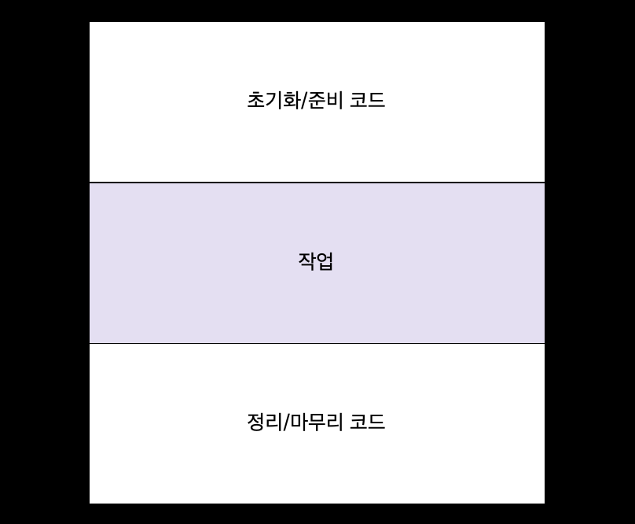
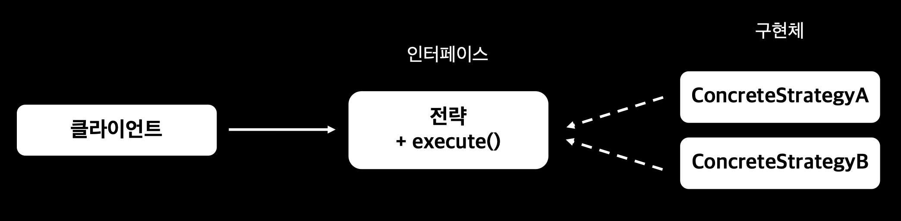
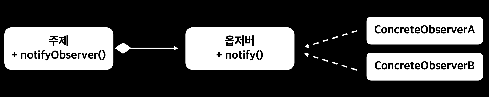
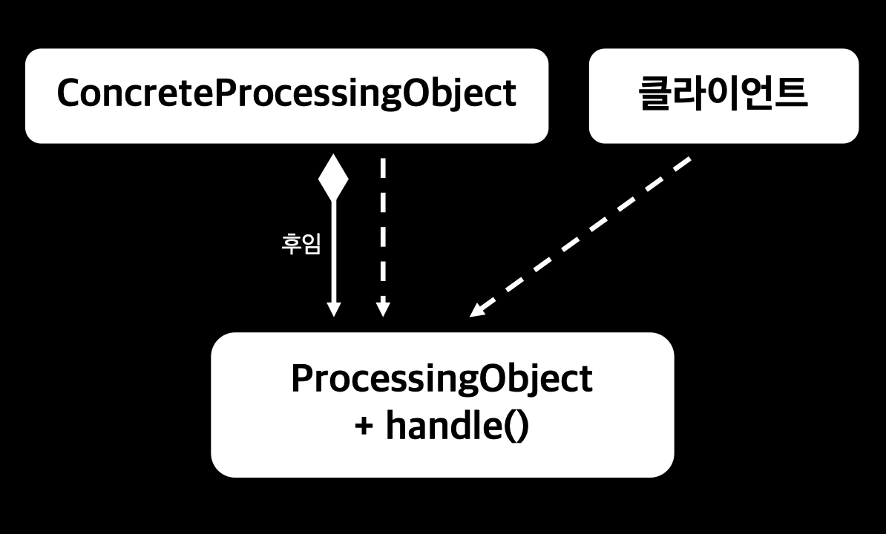

# 리팩터링, 테스팅, 디버깅

# 가독성과 유연성을 개선하는 리팩터링

<div align="center">

> 람다 표현식을 이용한 코드는 다양한 요구사항 변화에 대응할 수 있도록 동작을 파라미터화한다.

</div>

## 익명 클래스 ➡️ 람다 표현식

### 익명 클래스를 람다 표현식으로 변환할 수 없는 경우

1. **익명 클래스에서 사용한 this와 super는 람다 표현식에서 다른 의미를 갖는다**
   - 익명 클래스 this : 익명 클래스 자신
   - 람다 this : 람다를 감싸는 클래스
2. **익명 클래스는 감싸고 있는 클래스의 변수를 가릴 수 있다(섀도 변수)**

   ```java
   int a = 10;
   Runnable r1 = () -> {
     int a = 2; // 컴파일 에러
     System.out.println(a);
   };

   Runnable r2 = new Runnable() {
     @Override
     public void run() {
         int a = 2;
         System.out.println(a);
     }
   };
   ```

3. **익명 클래스를 람다 표현식으로 바꾸면 콘텍스트 오버로딩에 따른 모호함이 초래 될 수 있다**

   - 익명 클래스 : 인스턴스화할 때 명시적으로 형식 정해짐
   - 람다 : 형식이 콘텍스트에 따라 달라짐

   ```java
   interface Task {
       public void execute();
   }

   public static void doSomething(Runnable r) {
       r.run();
   }

   public static void doSomething(Task a) {
       a.execute();
   }

   doSomething(new Task() {
     @Override
     public void execute() {
         System.out.println("Danger danger!!");
     }
   });

   doSomething(() -> System.out.println("Danger danger!!"));
   // doSomethis(Runnable)인지 doSomething(Task)인지 알 수 없음

   doSomething((Task)() -> System.out.println("Danger danger!!"));
   // 명시적 형변환을 통해 모호함 제거 가능
   ```

## 람다 표현식 ➡️ 메서드 참조

```java
// 비교 구현에 신경 써야 함
inventory.sort(
       (Apple a1, Apple a2) -> a1.getWeight().compareTo(a2.getWeight())
);

// 정적 헬퍼 메서드 comparing 사용 ➡️ 코드가 문제 자체를 설명
inventory.sort(Comparator.comparing(Apple::getWeight));
```

```java
// 람다 표현식 + 저수준 리듀싱 연산 조회
int totalCalories = menu.stream()
       .map(Dish::getCalories)
       .reduce(0, (c1, c2) -> c1 + c2);

// 특화 스트림 사용 ➡️ 코드의 의도가 더 명확
int totalCalories2 = menu.stream().mapToInt(Dish::getCalories).sum();
```

## 명령형 데이터 처리 ➡️ 스트림

- 스트림 API는 데이터 처리 파이프라인의 의도를 더 명확하게 보여줌
- 쇼트서킷 + 게으름 = 강력한 최적화
- 쉽게 병렬화 가능

```java
List<String> dishNames = new ArrayList<>();
for (Dish dish: menu) {
   if (dish.getCalories() > 300) { // 필터링
       dishNames.add(dish.getName()); // 추출
   }
}

List<String> dishNames2 = menu.parallelStream()
       .filter(d -> d.getCalories() > 300)
       .map(Dish::getName)
       .toList();
```

## 코드 유연성 개선

### 조건부 연기 실행

- 특정 조건이 충족될 때 코드를 실행

```java
// 1️⃣
if (logger.isLoggable(Level.FINER)) { // isLoggable에 의해 logger의 코드가 클라이언트 코드로 노출
    logger.finer("Problem: " + generateDiagnostic());
}
// 메시지를 로깅할 때마다 logger 객체의 상태를 매번 확인

// 2️⃣
logger.log(Level.FINER, "Problem: " + generateDiagnostic());
// logger 레벨이 FINER가 아니어도 메세지 평가

// 3️⃣
logger.log(Level.FINER, () -> "Problem: " + generateDiagnostic());
// logger 레벨이 FINER일 때만 람다 실행
// 불필요한 문자열 연산 및 객체 생성을 피할 수 있음
```

```java
// 2️⃣ 내부 코드
public void log(Level level, String msg) {
    if (!isLoggable(level)) {
        return;
    }
    LogRecord lr = new LogRecord(level, msg);
    doLog(lr);
}

// 3️⃣ 내부 코드
public void log(Level level, Supplier<String> msgSupplier) {
    if (!isLoggable(level)) {
        return;
    }
    LogRecord lr = new LogRecord(level, msgSupplier.get());
    doLog(lr);
}
```

- 클라이언트 코드에서 객체 상태를 자주 확인하거나 객체의 일부 메서드를 호출하는 상황
  - 내부적으로 객체의 상태를 확인한 다음 메서드를 호출하는 것이 좋다
    - ➡️ 코드 가독성, 캡슐화 강화(객체 상태가 클라이언트 코드로 노출되지 않음)

### 실행 어라운드

- 매번 같은 준비, 종료 과정을 반복적으로 수행하는 코드
- `실행 어라운드 패턴` : 실제 자원을 처리하는 코드를 설정과 정리 두 과정이 둘러싸는 형태

<div align="center">



</div>

```java
@FunctionalInterface
public interface BufferedReaderProcessor {
    String process(BufferedReader b) throws IOException;
}

public static String processFile(BufferedReaderProcessor p) throws IOException {
    try (BufferedReader br = new BufferedReader(new FileReader("data.txt"))) {
        return p.process(br); // 인수로 전달된 BufferedReaderProcessor 실행
    }
}

// 클라이언트
String oneLine = processFile(BufferedReader::readLine); // 람다 전달
String twoLine = processFile((BufferedReader b) -> b.readLine() + b.readLine()); // 람다 전달
```

<br />

---

<br />

# 람다로 객체지향 디자인 패턴 리팩터링

- `디자인 패턴` : 공통적인 소프트웨어 문제를 설계할 때 재사용할 수 있는 검증된 청사진을 제공
- 람다를 이용하면 디자인 패턴으로 해결하던 문제를 더 쉽고 간단하게 해결할 수 있다

## `전략 패턴`

- 한 유형의 알고리즘을 보유한 상태에서 런타임에 적절한 알고리즘을 선택하는 기법
  - 다양한 기준을 갖는 입력값 검증, 다양한 파싱 방법 사용, 입력 형식 설정 ...



### 인터페이스

```java
public interface ValidationStrategy {
    boolean execute(String s);
}
```

### 구현체

```java
public class IsAllLowerCase implements ValidationStrategy{
    @Override
    public boolean execute(String s) {
        return s.matches("[a-z]+");
    }
}

public class IsNumeric implements ValidationStrategy{
    @Override
    public boolean execute(String s) {
        return s.matches("\\d+");
    }
}
```

### 클라이언트

```java
public class Validator {
    private final ValidationStrategy strategy;

    public Validator(ValidationStrategy strategy) {
        this.strategy = strategy;
    }

    public boolean validate(String s) {
        return strategy.execute(s);
    }
}

Validator numericValidator = new Validator(new IsNumeric());
boolean b1 = numericValidator.validate("aaa"); // false
Validator lowerCaseValidator = new Validator(new IsAllLowerCase());
boolean b2 = lowerCaseValidator.validate("bbb"); // true
```

### `람다 표현식 사용`

- 구현체를 구현할 필요 없이 람다식으로 간편하게 바로 전달할 수 있다

```java
Validator numericValidatorLambda = new Validator((String s) -> s.matches("\\d+"));
boolean b3 = numericValidatorLambda.validate("aaa"); // false
Validator lowerCaseValidatorLambda = new Validator((String s) -> s.matches("[a-z]+"));
boolean b4 = lowerCaseValidatorLambda.validate("bbb"); // true
```

## `템플릿 메서드 패턴`

- 알고리즘의 개요를 제시한 다음에 알고리즘의 일부를 고칠 수 있는 유연함을 제공해야 할 때

### 추상 클래스

```java
public abstract class OnlineBanking {
    public void processCustomer(int id) {
        Customer c = Database.getCustomerWithId(id);
        makeCustomerHappy(c);
    }

    abstract void makeCustomerHappy(Customer c);
}
```

- OnlineBanking 클래스를 상속받아 makeCustomerHappy 메서드가 원하는 동작 수행하도록 구현

### `람다 표현식 사용`

```java
public void processCustomer(int id, Consumer<Customer> makeCustomerHappy) {
  // makeCustoemrHappy 인수 추가
    Customer c = Database.getCustomerWithId(id);
    makeCustomerHappy.accept(c);
}
```

- OnlineBanking 클래스를 상속받지 않고 람다 표현식 전달하여 다양한 동작 추가 가능

```java
new OnlineBanking().processCustomer(1337, (Cusomer c) -> System.out.println("Hello " + c.getName()));
```

## `옵저버 패턴`

- 어떤 이벤트가 발생했을 때 한 객체(주제)가 다른 객체 리스트(옵저버)에 자동으로 알림을 보내야 할 때



### 옵저버 인터페이스

```java
public interface Observer {
    void notify(String tweet);
}
```

### 여러 옵저버 정의

```java
public class NYTimes implements Observer {
    @Override
    public void notify(String tweet) {
        if (tweet != null && tweet.contains("money")) {
            System.out.println("Breaking news in NY! " + tweet);
        }
    }
}
```

```java
public class Guardian implements Observer{
    @Override
    public void notify(String tweet) {
        if (tweet != null && tweet.contains("queen")) {
            System.out.println("Yet more news from London... " + tweet);
        }
    }
}
```

### 주제 인터페이스

```java
public interface Subject {
    void registerObserver(Observer o);
    void notifyObservers(String tweet);
}
```

### 주제 구현

```java
public class Feed implements Subject {
    private final List<Observer> observers = new ArrayList<>();

    @Override
    public void registerObserver(Observer o) {
        this.observers.add(o);
    }

    @Override
    public void notifyObservers(String tweet) {
        observers.forEach(o -> o.notify(tweet));
    }
}

Feed f = new Feed();
f.registerObserver(new NYTimes());
f.registerObserver(new Guardian());
f.notifyObservers("The queen said her favorite book is Modern Java in Action!");
// Yet more news from London... The queen said her favorite book is Modern Java in Action!
```

### `람다 표현식 사용`

- 옵저버가 상태를 가지며, 여러 메서드를 정의하는 등 복잡하다면 기존의 클래스 구현 방식 사용하는 것이 더 효율적

<br />
<div align="center">

> 람다는 불필요한 감싸는 코드 제거 전문가 😎

</div>
<br />

- 옵저버를 명시적으로 인스턴스화하지 않고 람다 표현식을 직접 전달해서 실행할 동작을 지정할 수 있다

```java
f.registerObserver(((String tweet) -> {
    if (tweet != null && tweet.contains("queen")) {
        System.out.println("Yet more news from London... " + tweet);
    }
}));
```

## `의무 체인 패턴`

- 작업 처리 객체의 체인을 만들 때
  - 한 객체가 어떤 작업을 처리한 다음에 다른 객체로 결과를 전달하고, 다른 객체도 해야 할 작업을 처리한 다음에 또 다른 객체로 전달

<div align="center">

</div>

### 작업 처리 추상 클래스

```java
public abstract class ProcessingObject<T> {
    protected ProcessingObject<T> successor;

    public void setSuccessor(ProcessingObject<T> successor) {
        this.successor = successor;
    }

    public T handle(T input) {
        T r = handleWork(input); // 현재 작업 처리 클래스의 handleWork 수행

        if (successor == null) { // successor가 없으면 그냥 r을 리턴
            return handleWork(r);
        }
        return successor.handleWork(r);
        // successor가 있으면 현재 작업 처리 클래스에서 처리된 결과
        // ➡️ successor 클래스의 handelWork 인자로 전달하여 수행한 결과를 리턴
    }

    abstract protected T handleWork(T input);
}
```

### 추상 클래스 구현

```java
public class HeaderTextProcessing extends ProcessingObject<String> {
    @Override
    protected String handleWork(String text) {
        return "From Raoul, Mario and Alan: " + text;
    }
}
```

```java
public class SpellCheckerProcessing extends ProcessingObject<String> {
    @Override
    protected String handleWork(String text) {
        return text.replaceAll("labda", "lambda");
    }
}
```

### 사용

```java
ProcessingObject<String> p1 = new HeaderTextProcessing();
ProcessingObject<String> p2 = new SpellCheckerProcessing();

p1.setSuccessor(p2); // 두 작업 처리 객체 연결

// header를 추가
// ➡️ 스펠링 체크
String result = p1.handle("Aren't labdas really sexy?!!");
// From Raoul, Mario and Alan: Aren't lambdas really sexy?!!
```

### `람다 표현식 사용`

- 추상 클래스 및 구현 클래스 모두 필요 없어짐

```java
UnaryOperator<String> headerProcessing = (String text) -> "From Raoul, Mario and Alan: " + text;
UnaryOperator<String> spellCheckerProcessing = (String text) -> text.replaceAll("labda", "lambda");
Function<String, String> pipeline = headerProcessing.andThen(spellCheckerProcessing);
String result2 = pipeline.apply("Aren't labdas really sexy?!!");
// From Raoul, Mario and Alan: Aren't lambdas really sexy?!!
```

## `팩토리 패턴`

- 인스턴스화 로직을 클라이언트에 노출하지 않고 객체를 만들 때
- 생성자와 설정을 외부로 노출하지 않음으로써 클라이언트가 단순하게 상품을 생산할 수 있다

```java
public class ProductFactory {
    public static Product createProduct(String name) {
        switch (name) {
            case "loan":
                return new Loan();
            case "stock":
                return new Stock();
            case "bond":
                return new Bond();
            default:
                throw new RuntimeException("No such Product: " + name);
        }
    }
}

Product p = ProductFactory.createProduct("loan");
```

### `람다 표현식 사용`

```java
public class ProductFactory {
    final static Map<String, Supplier<Product>> map = Map.ofEntries(
            Map.entry("loan", Loan::new), // 람다 메서드 참조 (Supplier<Product>)
            Map.entry("stock", Stock::new),
            Map.entry("bond", Bond::new)
    );

    public static Product createProduct(String name) {
        Supplier<Product> p = map.get(name);
        if (p != null) {
            return p.get();
        }
        throw new IllegalArgumentException("No Such product: " + name);
    }
}
```

# 람다 테스팅

```java
public class Point {
    private final int x;
    private final int y;

    public Point(int x, int y) {
        this.x = x;
        this.y = y;
    }

    public int getX() {
        return this.x;
    }

    public int getY() {
        return this.y;
    }

    public Point moveRightBy(int x) {
        return new Point(this.x + x, this.y);
    }
}
```

## 보이는 람다 표현식의 동작 테스팅

```java
// Point의 필드에 추가
public final static Comparator<Point> compareByXAndThenY =
        Comparator.comparing(Point::getX).thenComparing(Point::getY);
```

```java
@Test
public void testMoveRightBy() throws Exception {
    Point p1 = new Point(5, 5);

    assertThat(p1.moveRightBy(10).getX())
            .isEqualTo(15);
}
```

### 람다를 사용하는 메서드의 동작에 집중하라

- 메서드의 동작을 테스트함으로써 람다를 공개하지 않으면서도 람다 표현식을 검증

```java
public static List<Point> moveAllPointsRightBy(List<Point> points, int x) {
    return points.stream()
            .map(p -> new Point(p.getX() + x, p.getY())) // 람다 표현식을 직접 테스트하지 않음
            .toList();
}
```

```java
@Test
public void testMoveAllPointsRightBy() {
    List<Point> points = List.of(new Point(5, 5), new Point(10, 5));
    List<Point> expected = List.of(new Point(15, 5), new Point(20, 5));

    assertThat(Point.moveAllPointsRightBy(points, 10).stream().map(Point::getX).toList())
            .isEqualTo(expected.stream().map(Point::getX).toList());
}
```

### 고차원 함수 테스팅

- `고차원 함수` : 함수를 인수로 받거나 다른 함수를 반환하는 메서드

```java
public static <T> List<T> filter(List<T> list, Predicate<T> predicate) {
    List<T> result = new ArrayList<>();
    for (T e: list) {
        if (predicate.test(e)) {
            result.add(e);
        }
    }
    return result;
}
```

```java
@Test
public void testFilter() {
    List<Integer> numbers = List.of(1, 2, 3, 4);

    assertThat(Filter.filter(numbers, i -> i % 2 == 0))
            .isEqualTo(List.of(2, 4));
}
```

# 디버깅

## 스택 트레이스 확인

- 예외 발생시 프로그램 실행이 중단되면 스택 프레임에서 정보를 얻을 수 있다

### 람다와 스택 트레이스

- 람다는 이름이 없기 때문에 복잡한 스택 트레이스 생성됨 ➡️ 스택 트레이스에 예외가 발생한 함수의 이름이 명시적으로 드러나지 않음
- 람다 표현식과 관련한 스택 트레이스는 이해하기 어려울 수 있다

```java
List<Point> points = Arrays.asList(new Point(12, 2), null);
points.stream()
        .map(Point::getX)
        .forEach(System.out::println);
```

```bash
Exception in thread "main" java.lang.NullPointerException
	at java.base/java.util.stream.ReferencePipeline$3$1.accept(ReferencePipeline.java:197)
  # 스트림 파이프라인에서 세 번째 스텝의 첫 번째 연산인 accept 메서드에서 예외 발생
	at java.base/java.util.Spliterators$ArraySpliterator.forEachRemaining(Spliterators.java:992)
	at java.base/java.util.stream.AbstractPipeline.copyInto(AbstractPipeline.java:509)
	at java.base/java.util.stream.AbstractPipeline.wrapAndCopyInto(AbstractPipeline.java:499)
	at java.base/java.util.stream.ForEachOps$ForEachOp.evaluateSequential(ForEachOps.java:150)
	at java.base/java.util.stream.ForEachOps$ForEachOp$OfRef.evaluateSequential(ForEachOps.java:173)
	at java.base/java.util.stream.AbstractPipeline.evaluate(AbstractPipeline.java:234)
	at java.base/java.util.stream.ReferencePipeline.forEach(ReferencePipeline.java:596)
	at chap09_5.Debugging.main(Debugging.java:11)
```

## 정보 로깅

```java
List<Integer> numbers = List.of(2, 3, 4, 5);

numbers.stream()
        .map(x -> x + 17)
        .filter(x -> x % 2 == 0)
        .limit(3)
        .forEach(System.out::println); // 전체 스트림 소비
```

- map, filter, limit 각각의 연산이 어떤 결과를 도출하는지 확인하기
- `peek`
  - 스트림의 각 요소를 소비한 것처럼 동작하지만 실제로 소비하지는 않음
  - 자신이 확인한 요소를 파이프라인 다음 연산으로 그대로 넘겨줌

```java
List<Integer> result = numbers.stream()
        .peek(x -> System.out.println("from stream: " + x))
        .map(x -> x + 17)
        .peek(x -> System.out.println("after map: " + x))
        .filter(x -> x % 2 == 0)
        .peek(x -> System.out.println("after filter: " + x))
        .limit(3)
        .peek(x -> System.out.println("after limit: " + x))
        .toList();
```

```bash
from stream: 2
after map: 19
from stream: 3
after map: 20
after filter: 20
after limit: 20
from stream: 4
after map: 21
from stream: 5
after map: 22
after filter: 22
after limit: 22
```
