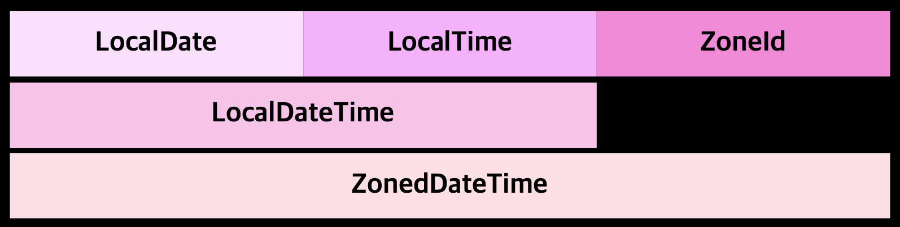

# 새로운 날짜와 시간 API

- 직관적이지 않은 java.util.Date
  - 현재 @Deprecated
  - 1990년을 기준으로 하는 오프셋
  - 0에서 시작하는 달 인덱스

```java
// 2017년 9월 21일을 만드는 코드
Date date = new Date(117, 8, 21);
// Thu Sep 21 00:00:00 KST 2017
```

- 쉽게 에러를 일으키는 java.util.Calender
  - 여전히 달의 인덱스는 0부터 시작
- Date, Calender는 모두 가변 클래스 ➡️ 유지보수가 어려움

# LocalDate, LocalTime, Instant, Duration, Period 클래스

- java.time 패키지

## LocalDate, LocalTime

- `LocalDate`
  - 시간을 제외한 날짜를 표현하는 불변 객체
  - 어떤 시간대 정보도 포함하지 않음

> This is a value-based class; programmers should treat instances that are equal as interchangeable and should not use instances for synchronization, or unpredictable behavior may occur. For example, in a future release, synchronization may fail. The equals method should be used for comparisons.

```java
LocalDate date = LocalDate.of(2017, 9, 21); // 2017-09-21
int year = date.getYear(); // 2017
Month month = date.getMonth(); // SEPTEMBER
int day = date.getDayOfMonth(); // 21
DayOfWeek dayOfWeek = date.getDayOfWeek(); // THURSDAY
int len = date.lengthOfMonth(); // 30
boolean isLeap = date.isLeapYear(); // false
```

```java
LocalDate today = LocalDate.now(); // 시스템 시계 정보를 이용해서 현재 날짜 정보를 얻음
```

- `LocalTime`

```java
System.out.println(time); // 13:45:20
System.out.println(hour); // 13
System.out.println(minute); // 45
System.out.println(second); // 20
```

### 문자열로 LocalDate와 LocalTime의 인스턴스 만들기

- `parse`

```java
LocalDate date = LocalDate.parse("2017-09-21");
LocalTime time = LocalTime.parse("13:45:20");
```

```java
public static LocalDate parse(CharSequence text) {
    return parse(text, DateTimeFormatter.ISO_LOCAL_DATE);
}

public static LocalDate parse(CharSequence text, DateTimeFormatter formatter) {
    Objects.requireNonNull(formatter, "formatter");
    return formatter.parse(text, LocalDate::from);
}
```

```java
public static LocalTime parse(CharSequence text) {
    return parse(text, DateTimeFormatter.ISO_LOCAL_TIME);
}

public static LocalTime parse(CharSequence text, DateTimeFormatter formatter) {
    Objects.requireNonNull(formatter, "formatter");
    return formatter.parse(text, LocalTime::from);
}
```

## 날짜와 시간 조합

- `LocalDateTime`

```java
// 2017-09-21T13:45:20
LocalDateTime dateTime1 = LocalDateTime.of(2017, Month.SEPTEMBER, 21, 13, 45, 20);
LocalDateTime dateTime2 = LocalDateTime.of(date, time);

LocalDateTime dateTime3 = date.atTime(13, 45, 20);
LocalDateTime dateTime4 = date.atTime(time);

LocalDateTime dateTime5 = time.atDate(date);
```

## Instant 클래스 : 기계의 날짜와 시간

- 기계의 관점에서는 연속된 시간에서 특정 지점을 하나의 큰 수로 표현하는 것이 가장 자연스러운 시간 표현 방법이다
- `java.time.Instant` 클래스에서는 기계적인 관점에서 시간을 표현한다
- 유닉스 에포크 시간(1970년 1월 1일 0시 0분 0초 UTC)을 기준으로 특정 지점까지의 시간을 초로 표현
- 나노초(10억분의 1초)의 정밀도를 제공
- 사람이 읽을 수 있는 시간 정보를 제공하지 않는다

```java
Instant.ofEpochSecond(3)
Instant.ofEpochSecond(3, 0)

Instant.now()
```

## Duration과 Period

- `Duration` : 두 시간 객체 사이의 지속시간
  - 초와 나노초로 시간 단위 표현
  - LocalDate를 전달할 수 없음

```java
Duration duration1 = Duration.between(time1, time2); // LocalTime
Duration duration2 = Duration.between(dateTime1, dateTime2); // LocalDateTime
Duration duration3 = Duration.between(instant1, instant2);
```

- `Period` : 두 LocalDate 차이

```java
Period period = Period.between(
        LocalDate.of(2017, 9, 11),
        LocalDate.of(2017, 9, 21));
```

```java
Duration threeMinutes = Duration.ofMinutes(3);
Duration threeMinutes2 = Duration.of(3, ChronoUnit.MINUTES);

Period tenDays = Period.ofDays(10);
Period threeWeeks = Period.ofWeeks(3);
Period twoYearsSixMonthsOneDay = Period.of(2, 6, 1);
```

### Durantion Period 공통 메서드

| 메서드           | 설명                                                       |
| ---------------- | ---------------------------------------------------------- |
| between (static) | 두 시간 사이의 간격 생성                                   |
| from (static)    | 시간 단위로 간격 생성                                      |
| of (static)      | 주어진 구성 요소에서 간격 인스턴스 생성                    |
| parse (static)   | 문자열을 파싱해서 간격 인스턴스 생성                       |
| addTo            | 현재 값의 복사본을 생성한 다음 지정된 Temporal 객체에 추가 |
| get              | 현재 간격 정보값 읽음                                      |
| isNegative       | 간격이 음수인지 확인                                       |
| isZero           | 간격이 0인지 확인                                          |
| minus            | 현재 값에서 주어진 시간을 뺀 복사본을 생성                 |
| multipliedBy     | 현재 값에 주어진 값을 곱한 복사본을 생성                   |
| negated          | 주어진 값의 부호를 반전한 복사본을 생성                    |
| plus             | 현재 값에 주어진 시간을 더한 복사본을 생성                 |
| subtractFrom     | 지정된 Temporal 객체에서 간격을 뺌                         |

# 날짜 조정, 파싱, 포매팅

- `withAttribute`
  - LocalDate를 바꾼 버전(`복사본`)을 직접 간단하게 만들 수 있음
  - 바뀐 속성을 포함하는 새로운 객체를 반환하는 메서드
  - 기존 객체를 바꾸지 않음

### 절대적인 방식

```java
LocalDate date1 = LocalDate.of(2017, 9, 21);
LocalDate date2 = date1.withYear(2011); // 2011-09-21
LocalDate date3 = date2.withDayOfMonth(25); // 2011-09-25
LocalDate date4 = date3.with(ChronoField.MONTH_OF_YEAR, 2); // 2011-02-25 / == withMonth(2)
```

### 상대적인 방식

```java
LocalDate date1 = LocalDate.of(2017, 9, 21);
LocalDate date5 = date1.plusWeeks(1); // 2017-09-27
LocalDate date6 = date5.minusYears(6); // 2011-09-27
LocalDate date7 = date6.plus(6, ChronoUnit.MONTHS); // 2012-03-27 / == plusMonths(6)
```

### 특정 시점을 표현하는 날짜 시간 클래스의 공통 메서드

| 메서드         | 설명                                                                      |
| -------------- | ------------------------------------------------------------------------- |
| from (static)  | 주어진 Temporal 객체를 이용해서 클래스의 인스턴스를 생성                  |
| now (static)   | 시스템 시계로 Temporal 객체를 생성                                        |
| of (static)    | 주어진 구성 요소에서 Temporal 객체의 인스턴스 생성                        |
| parse (static) | 문자열을 파싱해서 Temporal 객체 생성                                      |
| atOffset       | 시간대 오프셋과 Temporal 객체 살림                                        |
| atZone         | 시간대 오프셋과 Temporal 객체를 합침                                      |
| format         | 지정된 포매터를 이용해서 Temporal 객체를 문자열로 변환(Instant는 지원 ❌) |
| get            | Temporal 객체의 상태를 읽음                                               |
| minus          | 특정 시간을 뺀 Temporal 객체의 복사본 생성                                |
| plus           | 특정 시간을 더한 Temporal 객체의 복사본 생성                              |
| with           | 일부 상태를 바꾼 Temporal 객체의 복사본 생성                              |

## TemporalAdjusters

```java
LocalDate date1 = LocalDate.of(2014, 3, 18);
LocalDate date2 = date1.with(TemporalAdjusters.nextOrSame(DayOfWeek.SUNDAY)); // 2014-03-23
LocalDate date3 = date2.with(TemporalAdjusters.lastDayOfMonth()); // 2014-03-31
```

### TemporalAdjusters 팩토리 메서드

- 좀 더 복잡한 날짜 조정 기능을 직관적으로 해결할 수 있음
- 필요한 기능이 정의되어 있지 않은 경우 비교적 쉽게 커스텀 TemporalAdjuster 구현할 수 있음

```java
@FunctionalInterface
public interface TemporalAdjuster {
    Temporal adjustInto(Temporal temporal);
}

// TemporalAdjuster 구현
public class NextWorkingDay implements TemporalAdjuster {
    @Override
    public Temporal adjustInto(Temporal temporal) {
        DayOfWeek dow = DayOfWeek.of(temporal.get(ChronoField.DAY_OF_WEEK));
        return temporal.plus(calculateDayToAdd(dow), ChronoUnit.DAYS);
    }

    private int calculateDayToAdd(DayOfWeek dayOfWeek) {
        if (dayOfWeek == DayOfWeek.FRIDAY) {
            return 3;
        }
        if (dayOfWeek == DayOfWeek.SATURDAY) {
            return 2;
        }
        return 1;
    }
}

// LocalDate with 메서드
@Override
public LocalDate with(TemporalAdjuster adjuster) {
    // optimizations
    if (adjuster instanceof LocalDate) {
        return (LocalDate) adjuster;
    }
    return (LocalDate) adjuster.adjustInto(this);
}

// 사용
date.with(new NextWorkingDay())
```

| 메서드              | 설명                                                                                                                   |
| ------------------- | ---------------------------------------------------------------------------------------------------------------------- |
| dayOfWeekInMonth    | 서수 요일에 해당하는 날짜를 반환하는 TemporalAdjuster를 반환(음수를 사용하면 월의 끝에서 거꾸로 계산)                  |
| firstDayOfMonth     | 현재 달의 첫 번째 날짜를 반환하는 TemporalAdjuster를 반환                                                              |
| firstDayOfNextMonth | 다음 달의 첫 번째 날짜를 반환하는 TemporalAdjuster를 반환                                                              |
| firstDayOfNextYear  | 내년의 첫 번째 날짜를 반환하는 TemporalAdjuster를 반환                                                                 |
| firstDayOfYear      | 올해의 첫 번째 날짜를 반환하는 TemporalAdjuster를 반환                                                                 |
| firstInMonth        | 현재 달의 첫 번째 요일에 해당하는 날짜를 반환                                                                          |
| lastDayOfMonth      | 현재 달의 마지막 날짜를 반환하는 TemporalAdjuster를 반환                                                               |
| lastDayOfYear       | 올해의 마지막 날짜를 반환하는 TemporalAdjuster를 반환                                                                  |
| lastInMonth         | 현재 달의 마지막 요일에 해당하는 날짜를 반환하는 TemporalAdjusters를 반환                                              |
| next                | 현재 날짜 이후로 지정한 요일이 처음으로 나타나는 날짜를 반환하는 TemporalAdjusters를 반환                              |
| previous            | 현재 날짜 이전 지정한 요일이 처음으로 나타나는 날짜를 반환하는 TemporalAdjusters를 반환                                |
| nextOrSame          | 현재 날짜 기준 지정한 요일이 처음으로 나타나는 날짜 반환<strong>(현재 일자 포함)</strong>하는 TemporalAdjusters를 반환 |
| previousOrSame      | 현재 날짜 기준 지정한 요일이 이전으로 나타나는 날짜 반환<strong>(현재 일자 포함)</strong>하는 TemporalAdjusters를 반환 |

<br />

```java
// dayOfWeekInMonth
date.with(TemporalAdjusters.dayOfWeekInMonth(1, DayOfWeek.FRIDAY)) // 해당 월의 처음 금요일
// 음수 : 월의 끝에서 거꾸로 계산
date.with(TemporalAdjusters.dayOfWeekInMonth(-1, DayOfWeek.FRIDAY)) // 해당 월의 마지막 금요일

// firstDayOfMonth
date.with(TemporalAdjusters.firstDayOfMonth())

// firstDayOfNextMonth
date.with(TemporalAdjusters.firstDayOfNextMonth())

// firstDayOfNextYear
date.with(TemporalAdjusters.firstDayOfNextYear())

// firstDayOfYear
date.with(TemporalAdjusters.firstDayOfYear())

// firstInMonth
date.with(TemporalAdjusters.firstInMonth(DayOfWeek.MONDAY)) // 해당 월의 처음 월요일

// lastDayOfMonth
date.with(TemporalAdjusters.lastDayOfMonth())

// lastDayOfYear
date.with(TemporalAdjusters.lastDayOfYear())

// lastInMonth
date.with(TemporalAdjusters.lastInMonth(DayOfWeek.MONDAY)) // 해당 월의 마지막 월요일

// next
date.with(TemporalAdjusters.next(DayOfWeek.MONDAY)) // 현재 날짜 기준 다음 월요일

// previous
date.with(TemporalAdjusters.previous(DayOfWeek.MONDAY)) // 현재 날짜 기준 직전 월요일

// nextOrSame
date.with(TemporalAdjusters.nextOrSame(DayOfWeek.SUNDAY)) // 현재 날짜 기준 제일 빠르게 다가오는 일요일 찾기(현재 일자 포함)

// previousOrSame
date.with(TemporalAdjusters.previousOrSame(DayOfWeek.SUNDAY)) // 현재 날짜 기준 직전 일요일 찾기(현재 일자 포함)
```

## 날짜와 시간 객체 출력과 파싱

- `DateTimeFormatter`
  - 날짜나 시간을 특정 형식의 문자열로 만들 수 있다
    ```java
    LocalDate date = LocalDate.of(2024, 1, 27);
    String formattedDate1 = date.format(DateTimeFormatter.BASIC_ISO_DATE); // 20240127
    String formattedDate2 = date.format(DateTimeFormatter.ISO_LOCAL_DATE); // 2024-01-27
    ```
  - 날짜나 시간을 표현하는 문자열을 파싱해서 날짜 객체를 다시 만들 수 있다
    ```java
    LocalDate date1 = LocalDate.parse("20240127", DateTimeFormatter.BASIC_ISO_DATE);
    LocalDate date2 = LocalDate.parse("2024-01-27", DateTimeFormatter.ISO_LOCAL_DATE);
    // 2024-01-27 이 형태는 Formatter 안 쓰고 text만 써도 됨
    ```
  - 특정 패턴으로 포매터 만들기 `ofPattern`
    ```java
    DateTimeFormatter formatter = DateTimeFormatter.ofPattern("***yyyy년 MM월 dd일***");
    LocalDate date3 = LocalDate.of(2024, 1, 27);
    String formattedDate3 = date3.format(formatter); // ***2024년 01월 27일***
    LocalDate date4 = LocalDate.parse(formattedDate3, formatter);
    ```
  - 지역화된 포매터 만들기
    ```java
    DateTimeFormatter chineseFormatter = DateTimeFormatter.ofPattern("d. MMMM yyyy", Locale.CHINESE);
    // MMMM으로 적어야 함
    String formattedDate4 = date3.format(chineseFormatter); // 27. 一月 2024
    ```
  - 세부적으로 만들기
    ```java
    DateTimeFormatter italianFormatter = new DateTimeFormatterBuilder()
            .appendText(ChronoField.DAY_OF_MONTH)
            .appendLiteral(". ")
            .appendText(ChronoField.MONTH_OF_YEAR)
            .appendLiteral(" ")
            .appendText(ChronoField.YEAR)
            .parseCaseInsensitive() // 대소문자를 구분하지 않도록 변경, 기본 : 대소문자 구분
            .toFormatter(Locale.ITALIAN);
    ```

# 다양한 시간대와 캘린더 활용

- `java.time.ZoneId`
  - 서머타임(DST) 같은 복잡한 사항이 자동으로 처리
  - 불변 클래스

## 시간대 사용하기

- `ZoneRules`
  - `getRules()` : 해당 시간대의 규정 획득

```java
ZoneId romeZone = ZoneId.of("Europe/Rome"); // {지역}/{도시}
// IANA Time Zone Database : https://www.iana.org/time-zones
```

```java
// 현재 위치의 timeZone을 ZoneId 객체로 바꾸기
ZoneId zoneId = TimeZone.getDefault().toZoneId(); // Asia/Seoul
```

### 특정 시점에 시간대 적용

```java
ZoneId romeZone = ZoneId.of("Europe/Rome");

LocalDate date = LocalDate.of(2024, 1, 27);
ZonedDateTime zonedDateTime1 = date.atStartOfDay(romeZone); // 2024-01-27T00:00+01:00[Europe/Rome]

LocalDateTime dateTime = LocalDateTime.of(2024, 1, 27, 18, 13, 45);
ZonedDateTime zonedDateTime2 = dateTime.atZone(romeZone); // 2024-01-27T18:13:45+01:00[Europe/Rome]

Instant instant = Instant.now();
ZonedDateTime zonedDateTime3 = instant.atZone(romeZone); // 2024-01-27T14:37:17.792039+01:00[Europe/Rome]
```



### Instant ➡️ LocalDateTime

- 기존의 Date 클래스를 처리하는 코드를 사용하는 경우 Instant로 작업하는 것이 유리

```java
Instant instant = Instant.now();
LocalDateTime timeFromInstant = LocalDateTime.ofInstant(instant, romeZone);
```

- toInstant()
- from(Instant)

## UTC/Greenwich 기준의 고정 오프셋

- UTC(Universal Time Cooordinated) : 협정 세계시
- GMT(Greenwich Mean Time) : 그리니치 표준시
- `ZoneOffset` : 특정 지역이 그리니치/UTC와 얼마만큼 차이가 나는지를 나타냄
  - 대한민국(GMT+9) : GMT보다 9시간 빠름
  - 미국 뉴욕(GMT-5) : GMT보다 5시간 느림

```java
ZoneOffset seoulOffset = ZoneOffset.of("+09:00");

LocalDateTime dateTime1 = LocalDateTime.of(2024, 1, 27, 13, 45);
OffsetDateTime dateTimeInSeoul = OffsetDateTime.of(dateTime1, seoulOffset);
```

### ISO-8601 표준 시스템을 준수하지 않는 캘린더 시스템도 사용할 수 있음

- ThaiBuddhistDate, MinguoDate, JapaneseDate, HijrahDate(이슬람력)

  ```java
  JapaneseDate japaneseDate = JapaneseDate.from(LocalDate.of(2014, 2, 20));
  // Japanese Heisei 26-02-20
  ```

- 특정 Locale과 Locale에 대한 날짜 인스턴스로 캘린더 시스템 만들기
  - Chronology : 특정 달력 시스템을 가져옴
  - ChronoLocalDate : 임의의 연대기에서 특정 날짜를 표현할 수 있는 기능을 제공하는 인터페이스
  ```java
  Chronology japaneseChronology = Chronology.ofLocale(Locale.JAPAN);
  ChronoLocalDate now = japaneseChronology.dateNow();
  ```
- 프로그램의 입출력을 지역화하는 상황을 제외하고는 LocalDate 사용
