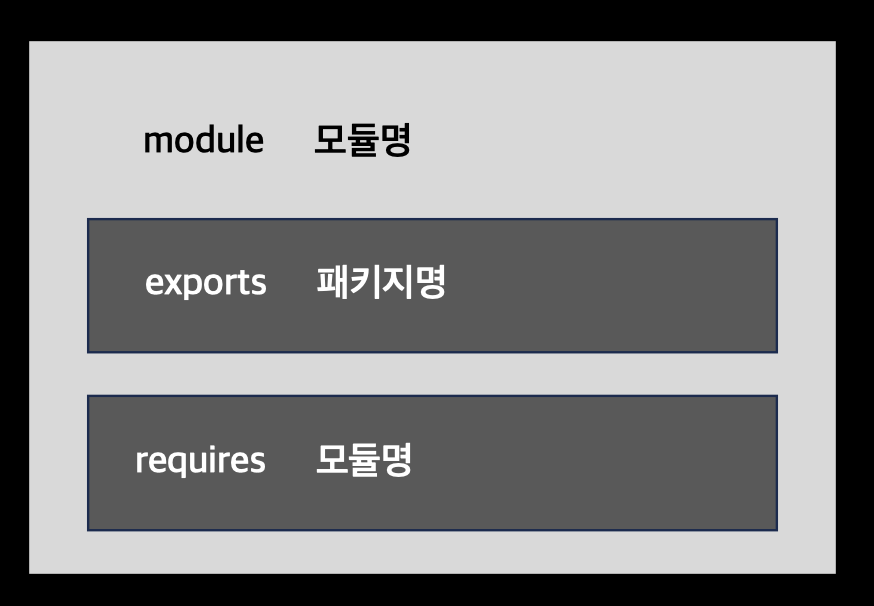

# 자바 모듈 시스템

# 압력 : 소프트웨어 유추

- 소프트웨어 아키텍처(고수준) 수준에서는 기반 코드를 바꿔야 할 때 생산성을 높일 수 있는 유추하기 쉬운 소프트웨어 프로젝트가 필요하다

## 관심사 분리(SoC, Separation of Concenrs)

> 컴퓨터 프로그램을 고유의 기능으로 나누는 동작을 권장하는 원칙

- 기능이 서로 거의 겹치지 않는 코드 그룹으로 분리
- 클래스를 그룹화한 모듈을 이용해 애플리케이션의 클래스 간의 관계를 시각적으로 보여줄 수 있음
- 자바 9 모듈은 클래스가 어떤 다른 클래스를 볼 수 있는지 컴파일 시간에 정교하게 제어할 수 있다
- 모델, 뷰, 컨트롤러 같은 아키텍처 관점, 복구 기법을 비즈니스 로직과 분리하는 등 하위 수준 접근 등의 상황에 유용하다

### 장점

- 개별 기능을 따로 작업 ➡️ 협업 효율성 ⬆️
- 개별 부분 재사용성 ⬆️
- 전체 시스템 유지보수성 ⬆️

## 정보 은닉(information hidding)

> 세부 구현을 숨기도록 장려하는 원칙

- 세부 구현을 숨기면 프로그램의 어떤 부분을 바꿨을 때 다른 부분까지 영향을 미칠 가능성을 줄일 수 있음
- 코드를 관리하고 보호하는 데 유용
- `캡슐화(encapsulation)`(특정 코드 조각이 애플리케이션의 다른 부분과 고립되어 있음)
- 자바 9 클래스와 패키지가 의도된 대로 공개되었는지 컴파일러로 확인 가능
  - 클래스 내의 컴포넌트에 적절하게 private 키워드를 기준으로 캡슐화 확인

# 자바 모듈 시스템을 설계한 이유

## 모듈화의 한계

- 자바 9 이전까지 클래스와 관련해 접근 제한자와 캡슐화 지원
- 하지만 패키지와 JAR 수준에서는 캡슐화를 거의 지원하지 않았음
- 가시성 접근자(public, protected, 패키지 수준, private)의 한계 명확
  - 한 패키지의 클래스와 인터페이스를 다른 패키지로 공개하려면 private로 선언해야 함

### 클래스 경로

- 클래스 경로와 JAR 조합의 약점

1. 클래스 경로에는 같은 클래스를 구분하는 버전 개념이 없음
   - 다양한 컴포넌트가 같은 라이브러리의 다른 버전을 사용하는 상황에서 어떤 일이 일어날지 알 수 없음
2. 클래스 경로는 명시적인 의존성을 지원하지 않음
   - 한 JAR이 다른 JAR에 포함된 클래스 집합을 사용하라고 명시적으로 의존성을 정의하는 기능을 제공하지 않음

- 자바 9 모듈 시스템을 이용하면 컴파일 타임에 발생 가능한 에러를 검출할 수 있음

## 거대한 JDK(자바 개발 키트)

- JDK 라이브러리의 많은 내부 API는 공개되지 않아야 하지만 자바 언어의 낮은 캡슐화 지원 때문에 공개되었음
- JDK 자체도 모듈화할 수 있는 자바 모듈 설계의 필요성 제기
  - JDK에서 필요한 부분만 골라서 사용
  - 클래스 경로 쉽게 유출 가능
  - 플랫폼 진화시킬 수 있는 강력한 캡슐화를 제공할 새로운 건축 구조 필요

# 자바 모듈

- 새로운 자바 프로그램 구조 단위
- module이라는 새 키워드에 이름과 바디를 추가해서 정의
- 모듈 디스크립터는 module-info.java라는 파일에 저장됨
  - 보통 패키지와 같은 폴더에 위치
  - 한 개 이상의 패키지를 서술하고 캡슐화할 수 있음
  - 단순한 상황에서는 패키지 중 한 개만 외부로 노출

### module-info.java 구조



# 자바 모듈 시스템으로 애플리케이션 개발하기

## 애플리케이션 셋업

- 관심사에 따라 모듈화

```markdown
- 다양한 소스에서 데이터를 읽음(Reader, HttpReader, FileReader)
- 다양한 포맷으로 구성된 데이터를 파싱(Parser, JSONParser, ExpenseJSON-Parser)
- 도메인 객체 구체회(Expense)
- 통계를 계산하고 반환(SummaryCalculator, SummaryStatistics)
- 다양한 기능을 분리 조정(ExpensesApplication)
```

- 각 기능을 그룹화

```markdown
- expenses.readers
- expenses.readers.http
- expenses.readers.file
- expenses.parsers
- expenses.parsers.json
- expenses.model
- expenses.statistics
- expenses.application
```

## 세부적인 모듈화와 거친 모듈화

- `세부적인 모듈화` : 모든 패키지가 자신의 모듈을 가짐
  - 설계 비용 증가
- `거친 모듈화` : 한 모듈이 시스템의 모든 패키지를 포함
  - 모듈화의 장점 ❌
- ✅ 시스템을 실용적으로 분해하면서 진화하는 소프트웨어 프로젝트가 이해하기 쉽고 고치기 쉬운 수준으로 적절하게 모듈화되어 있는지 주기적으로 확인하는 프로세스

<div align="center">

> 모듈화는 소프트웨어 부식의 적이다

</div>

## 자바 모듈 시스템 기초

- `module-info.java`
  - 모듈 디스크립터
  - 모듈의 소스 코드 파일 루트에 위치
  - 모듈의 의존성 및 어떤 기능을 외부로 노출할지 정의

```java
module expenses.application { // 모듈명
}
```

```bash
# 컴파일
# module-info.java가 있는 디렉토리에서
javac module-info.java com/example/expenses/application/ExpensesApplication.java -d target
# target 디렉토리가 생성되며 자바 모듈이 컴파일 됨
```

```bash
# jar 패키징
jar cvfe expenses-application.jar com.example.expenses.application.ExpensesApplication -C target .
# target 디렉토리의 컴파일된 클래스 파일들을 이용하여 expenses-application.jar라는 JAR 파일 생성
# 실행 진입점을 com.example.expenses.application.ExpensesApplication 클래스로 설정
# JAR 파일은 target 디렉토리에 생성됨(-C target)
# 현재 디렉토리의 모든 파일 및 하위 디렉토리가 JAR 파일에 포함됨(.)
```

```bash
# 어떤 폴더와 클래스 파일이 JAR(expenses-application.jar)에 포함되어 있는지 보여주는 결과 출력됨
added manifest
added module-info: module-info.class
adding: com/(in = 0) (out= 0)(stored 0%)
adding: com/example/(in = 0) (out= 0)(stored 0%)
adding: com/example/expenses/(in = 0) (out= 0)(stored 0%)
adding: com/example/expenses/application/(in = 0) (out= 0)(stored 0%)
adding: com/example/expenses/application/ExpensesApplication.class(in = 245) (out= 187)(deflated 23%)
```

```bash
# 실행
java --module-path expenses-application.jar --module expenses.application/com.example.expenses.application.ExpensesApplication
```

- `--module-path` : 어떤 모듈을 로드할 수 있는지 지정
- `--module` : 실행할 메인 모듈과 클래스 지정

### 디렉토리 구조

```bash
├── expenses
│   └── expenses.application
│       └── src
│           ├── main
│           │   ├── java
│           │   │   ├── com
│           │   │   │   └── example
│           │   │   │       └── expenses
│           │   │   │           └── application
│           │   │   │               └── ExpensesApplication.java
│           │   │   ├── expenses-application.jar
│           │   │   ├── module-info.java
│           │   │   └── target
│           │   │       ├── com
│           │   │       │   └── example
│           │   │       │       └── expenses
│           │   │       │           └── application
│           │   │       │               └── ExpensesApplication.class
│           │   │       └── module-info.class
```

# 여러 모듈 활용

### 디렉토리 구조

```bash
├── expenses
│   ├── expenses.application
│   │   └── src
│   │       ├── main
│   │       │   ├── java
│   │       │   │   ├── com
│   │       │   │   │   └── example
│   │       │   │   │       └── expenses
│   │       │   │   │           └── application
│   │       │   │   │               └── ExpensesApplication.java
│   │       │   │   ├── expenses-application.jar
│   │       │   │   ├── module-info.java
│   │       │   │   └── target
│   │       │   │       ├── com
│   │       │   │       │   └── example
│   │       │   │       │       └── expenses
│   │       │   │       │           └── application
│   │       │   │       │               └── ExpensesApplication.class
│   │       │   │       └── module-info.class
│   │       │   └── resources
│   │       └── test
│   │           ├── java
│   │           └── resources
│   └── expenses.readers
│       └── src
│           └── main
│               └── java
│                   ├── com
│                   │   └── example
│                   │       └── expenses
│                   │           └── readers
│                   │               ├── Reader.java
│                   │               ├── file
│                   │               │   └── FileReader.java
│                   │               └── http
│                   │                   └── HttpReader.java
│                   └── module-info.java
```

## `exports` 구문

```java
module expenses.readers {
    exports com.example.expenses.readers; // 패키지 명
    exports com.example.expenses.readers.file;
    exports com.example.expenses.readers.http;
}
```

- `exports` : 다른 모듈에서 사용할 수 있도록 특정 패키지를 공개 형식으로 만듦
- 모듈 시스템은 화이트 리스트 기법을 이용해 강력한 캡슐화를 제공하므로 다른 모듈에서 사용할 수 있는 기능이 무엇인지 명시적으로 결정해야 함

## `requires` 구문

```java
module expenses.readers {
    requires java.base; // 모듈 명

    exports com.example.expenses.readers;
    exports com.example.expenses.readers.file;
    exports com.example.expenses.readers.http;
}
```

- `requires` : 의존하고 있는 모듈 지정
  - `java.base` 외의 모듈을 임포트할 때 사용
- `java.base` : 플랫폼 모듈, net, io, util 등 자바 메인 패키지 포함
  - 항상 기본적으로 필요한 모듈
  - 명시적으로 정의할 필요 없음

## 이름 정하기

- 인터넷 도메인명 역순
- 노출된 주요 API 패키지와 이름이 같아야 함

# 컴파일과 패키징 - maven

- root, expenses.application, expenses.readers에 각각 pom.xml 파일을 추가해 주어야 함

### 📁 root/pom.xml

```xml
<?xml version="1.0" encoding="UTF-8"?>
<project xmlns="http://maven.apache.org/POM/4.0.0"
         xmlns:xsi="http://www.w3.org/2001/XMLSchema-instance"
         xsi:schemaLocation="http://maven.apache.org/POM/4.0.0 http://maven.apache.org/xsd/maven-4.0.0.xsd">
    <modelVersion>4.0.0</modelVersion>

    <groupId>com.example</groupId>
    <artifactId>expenses</artifactId>
    <packaging>pom</packaging>
    <version>1.0</version>

    <!--모듈 참조(자식 부산물 ID 참조)-->
    <modules>
        <module>expenses.application</module>
        <module>expenses.readers</module>
    </modules>

    <build>
        <pluginManagement>
            <plugins>
                <plugin>
                    <groupId>org.apache.maven.plugins</groupId>
                    <artifactId>maven-compiler-plugin</artifactId>
                    <version>3.7.0</version>
                    <configuration>
                        <source>9</source>
                        <target>9</target>
                    </configuration>
                </plugin>
            </plugins>
        </pluginManagement>
    </build>

</project>
```

### 📁 expenses.application/pom.xml

```xml
<?xml version="1.0" encoding="UTF-8"?>
<project xmlns="http://maven.apache.org/POM/4.0.0"
         xmlns:xsi="http://www.w3.org/2001/XMLSchema-instance"
         xsi:schemaLocation="http://maven.apache.org/POM/4.0.0 http://maven.apache.org/xsd/maven-4.0.0.xsd">
    <modelVersion>4.0.0</modelVersion>

    <!--부산물(artifact)-->
    <groupId>com.example</groupId>
    <artifactId>expenses.application</artifactId>
    <version>1.0</version>
    <packaging>jar</packaging>

    <!--부모 모듈 명시적으로 지정-->
    <parent>
        <groupId>com.example</groupId>
        <artifactId>expenses</artifactId>
        <version>1.0</version>
    </parent>

    <!--expenses.readers 의존성 추가-->
    <dependencies>
        <dependency>
            <groupId>com.example</groupId>
            <artifactId>expenses.readers</artifactId>
            <version>1.0</version>
            <scope>compile</scope>
        </dependency>
    </dependencies>

</project>
```

### 📁 expenses.readers/pom.xml

```xml
<?xml version="1.0" encoding="UTF-8"?>
<project xmlns="http://maven.apache.org/POM/4.0.0"
         xmlns:xsi="http://www.w3.org/2001/XMLSchema-instance"
         xsi:schemaLocation="http://maven.apache.org/POM/4.0.0 http://maven.apache.org/xsd/maven-4.0.0.xsd">
    <modelVersion>4.0.0</modelVersion>

    <groupId>com.example</groupId>
    <artifactId>expenses.readers</artifactId>
    <version>1.0</version>
    <packaging>jar</packaging>

    <parent>
        <groupId>com.example</groupId>
        <artifactId>expenses</artifactId>
        <version>1.0</version>
    </parent>
</project>
```

### 빌드

- root pom.xml이 있는 경로에서

```bash
mvn clean package
```

### 실행

```bash
java --module-path \
./expenses.application/target/expenses.application-1.0.jar:./expenses.readers/target/expenses.readers-1.0.jar \
--module expenses.application/com.example.expenses.application.ExpensesApplication
```

### 최종 디렉토리 구조

```bash
├── expenses.application
│   ├── pom.xml
│   ├── src
│   │   ├── main
│   │   │   ├── java
│   │   │   │   ├── com
│   │   │   │   │   └── example
│   │   │   │   │       └── expenses
│   │   │   │   │           └── application
│   │   │   │   │               └── ExpensesApplication.java
│   │   │   │   ├── expenses-application.jar
│   │   │   │   ├── module-info.java
│   │   │   │   └── target
│   │   │   │       ├── com
│   │   │   │       │   └── example
│   │   │   │       │       └── expenses
│   │   │   │       │           └── application
│   │   │   │       │               └── ExpensesApplication.class
│   │   │   │       └── module-info.class
│   │   │   └── resources
│   │   └── test
│   │       └── java
│   └── target
│       ├── classes
│       │   ├── com
│       │   │   └── example
│       │   │       └── expenses
│       │   │           └── application
│       │   │               └── ExpensesApplication.class
│       │   └── module-info.class
│       ├── expenses.application-1.0.jar
│       ├── generated-sources
│       │   └── annotations
│       ├── maven-archiver
│       │   └── pom.properties
│       └── maven-status
│           └── maven-compiler-plugin
│               ├── compile
│               │   └── default-compile
│               │       ├── createdFiles.lst
│               │       └── inputFiles.lst
│               └── testCompile
│                   └── default-testCompile
│                       └── inputFiles.lst
├── expenses.readers
│   ├── pom.xml
│   ├── src
│   │   └── main
│   │       └── java
│   │           ├── com
│   │           │   └── example
│   │           │       └── expenses
│   │           │           └── readers
│   │           │               ├── Readers.java
│   │           │               ├── file
│   │           │               │   └── FileReader.java
│   │           │               └── http
│   │           │                   └── HttpReader.java
│   │           └── module-info.java
│   └── target
│       ├── classes
│       │   ├── com
│       │   │   └── example
│       │   │       └── expenses
│       │   │           └── readers
│       │   │               ├── Readers.class
│       │   │               ├── file
│       │   │               │   └── FileReader.class
│       │   │               └── http
│       │   │                   └── HttpReader.class
│       │   └── module-info.class
│       ├── expenses.readers-1.0.jar
│       ├── generated-sources
│       │   └── annotations
│       ├── maven-archiver
│       │   └── pom.properties
│       └── maven-status
│           └── maven-compiler-plugin
│               └── compile
│                   └── default-compile
│                       ├── createdFiles.lst
│                       └── inputFiles.lst
├── moduleSystemTestMaven.iml
└── pom.xml
```

## gradle

### 📁 root/build.gradle

- 아래와 같이 수정

```gradle
group = 'com.example'
version = '1.0'
```

### 📁 expenses.application/build.gradle

- 아래와 같이 수정 및 추가

```gradle
group = 'com.example'
version = '1.0'

dependencies {
    testImplementation platform('org.junit:junit-bom:5.9.1')
    testImplementation 'org.junit.jupiter:junit-jupiter'
    implementation project(':expenses.readers')
}
```

## 📁 expenses.readers/build.gradle

- 아래와 같이 수정

```gradle
group = 'com.example'
version = '1.0'
```

## 빌드

```bash
./gradlew build
```

## 실행

```bash
java --module-path ./expenses.application/build/libs/expenses.application-1.0.jar:./expenses.readers/build/libs/expenses.readers-1.0.jar --module expenses.application/com.example.expenses.application.ExpensesApplication
```

# 자동 모듈

```java
module expenses.readers {
    requires org.apache.httpcomponents.httpclient; // 추가
}
```

### 📁 readers/pom.xml dependency 추가

```xml
<dependencies>
    <dependency>
        <groupId>org.apache.httpcomponents</groupId>
        <artifactId>httpclient</artifactId>
        <version>4.5.13</version>
    </dependency>
</dependencies>
```

- `mvn clean package`를 실행하면 빌드됨
- httpclient는 모듈화되어 있지 않은 라이브러리
  - ➡️ 자바는 JAR을 `자동 모듈`이라는 형태로 자동 변환
  - 자동 모듈은 암묵적으로 자신의 모든 패키지를 노출시킴
  - 자동 모듈의 이름은 JAR 이름을 이용해 정해짐

# 모듈 정의와 구문들

## `requires`

- 컴파일 타임과 런타임에 한 모듈이 다른 모듈에 의존함을 정의

```java
module com.iteratrlearning.application {
  requires com.iteratrlearning.ui; // 모듈명
}
// com.iteratrlearning.application은 com.iteratrlearning.ui 모듈에 의존
// com.iteratrlearning.ui에서 외부로 노출한 공개 형식을 사용 가능
```

## `exports`

- 지정한 패키지를 다른 모듈에서 이용할 수 있도록 공개 형식으로 만듦
- 기본 설정 : 아무 패키지도 공개하지 않음

```java
module com.iteratrlearning.ui {
  requires com.iteratrlearning.core;

  exports com.iteratrlearning.ui.panels; // 패키지명
}
```

## `requires transitive`

- 다른 모듈이 제공하는 공개 형식을 한 모듈에서 사용할 수 있다고 지정
- 전이성 선언

```java
module com.iteratrlearning.ui {
  requires transitive com.iteratrlearning.core;

  exports com.iteratrlearning.ui.panels;
}

module com.iteratrlearning.application {
  requires com.iteratrlearning.ui;
}
// application이 ui를 의존하지만
// ui에서 core를 전이성 선언
// application도 core가 노출한 공개 형식에 접근 가능
// application ➡️ ui ➡️ core
```

## `exports to`

- 사용자에게 공개할 기능을 제한하여 가시성을 좀 더 정교하게 제어
- 노출한 패키지를 사용할 수 있는 모듈을 한정

```java
module com.iteratrlearning.ui {
  requires com.iteratrlearning.core;

  exports com.iteratrlearning.ui.panels;
  exports com.iteratrlearning.ui.widgets to
    com.iteratrlearning.ui.widgetuser;
}
```

## `open`, `opens`

- 반사적인 접근 권한을 주는 것 이외에 모듈의 가시성에 다른 영향을 미치지 않음
- 리플렉션(프로그램이 자기 자신의 구조를 조사하거나 수정할 수 있는 능력)과 관련된 모듈 지시자
- 모듈은 기본적으로 공유 유형 및 패키지가 아닌 한 다른 모듈에서 액세스 할 수 없음
  - 원하는 패키지만 노출
- 기본적으로 특정 패키지에 대한 런타임 반사 액세스 권한이 있는 모듈은 해당 패키지의 public 유형(및 중첩된 public 및 protected 유형)을 볼 수 있다

### `open`

- 모듈 선언에서 사용
- 모든 패키지를 다른 모듈에 반사적으로 접근 허용할 수 있음
- 특정 모듈 내의 모든 패키지에 대한 런타임 전용 액세스를 허용

```java
open module com.iteratrlearning.ui {

}
```

### `opens`

- 패키지 선언에서 사용
- 특정 패키지에 대한 런타임 전용 액세스를 허용

```java
opens package
```

### `opens...to`

- 특정 패키지에 대한 지정된 모듈들의 런타임 전용 액세스 허용

```java
opens pacage to module1,module2,module3
```

### export와 opens

- export: 패키지를 다른 모듈에게 공개하여 컴파일 타임에 접근을 허용
- opens: 패키지를 리플렉션을 통한 동적 접근에 대해 특정 모듈에게 공개하여 런타임에 동적으로 접근을 허용

## `uses`, `provides`

- `provides` : 서비스 제공자 지정
- `uses` : 서비스 소비자 지정
