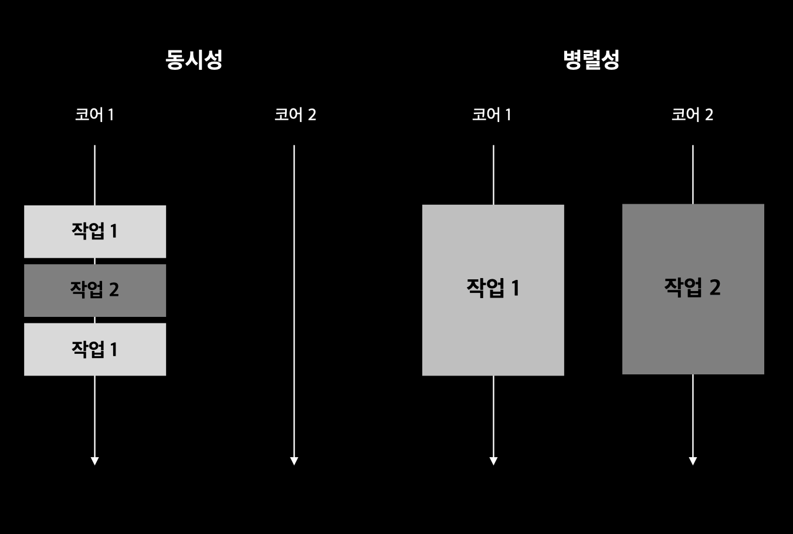

# CompletableFuture와 리액티브 프로그래밍 컨셉의 기초

- 공개 API를 사용하지 않고 독립적으로 동작하는 웹사이트나 네트워크 애플리케이션을 찾아보기 힘들다
  - 다양한 소스의 컨텐츠를 가져와서 사용자가 삶을 풍요롭게 만들도록 합치는 `매시업(mashup)` 형태
- 매시업 애플리케이션을 구현하려면 여러 웹 서비스에 접근 해야 한다
  - 서비스의 응답을 기다리는 동안 연산이 블록되거나 CPU 클록 사이클 자원을 낭비하고 싶지 않다
- `동시성` 필요
  - 조금씩 연관된 작업을 같은 CPU에서 동작
  - 애플리케이션 생산성을 극대화할 수 있도록 코어를 바쁘게 유지



- `동시성` : 단일 코어 머신에서 발생할 수 있는 프로그래밍 속성 / 실행이 서로 겹칠 수 있음
- `병렬성` : 병렬 실행을 하드웨어 수준에서 지원

# 동시성을 구현하는 자바 지원의 진화

- `리액티브 프로그래밍` : 비동기적인 데이터 스트림 또는 이벤트를 다루기 위한 프로그래밍 패러다임
  - 데이터 스트림 또는 이벤트가 발생할 때마다 시스템이 자동으로 반응하도록 하는 것
- 자바 9 분산 비동기 프로그래밍을 명시적으로 지원
  - 매쉬업 애플리케이션을 개발하는데 필수적인 기초 모델과 툴킷 제공
  - 발행-구독 프로토콜(java.util.concurrent.Flow)
- 가능한한 동시에 실행할 수 있는 독립적인 태스크를 동시 실행 가능하게 만들면서 멀티코어 또는 여러 기기를 통해 제공되는 병렬성을 쉽게 이용하는 것이 목표

## 스레드와 높은 수준의 추상화

- 스트림을 이용해 스레드 사용 패턴을 추상화할 수 있다
  - 쓸모 없는 코드가 라이브러리 내부로 구현되며 복잡성 ⬇️

```java
Arrays.stream(stats)
        .parallel()
        .sum();
```

## Executor와 스레드 풀

- 자바 5 : 자바 프로그래머가 태스크 제출과 실행을 분리할 수 있는 기능 제공

### 스레드의 문제

- 자바 스레드는 직접 운영체제 스레드에 접근
- 운영체제 스레드를 만들고 종료하려면 비싼 비용을 치러야 함
- 운영체제 스레드의 숫자는 제한되어 있음
- 운영체제가 지원하는 스레드 수를 초과해 사용하면 애플리케이션이 예상치 못한 방식으로 크래시될 수 있으므로 주의해야 함

### 스레드 풀이 더 좋은 이유

- ExcutorService : 태스크를 제출하고 나중에 결과를 수집할 수 있는 인터페이스를 제공
- newFixedThreadPool 같은 팩토리 메서드 중 하나를 이용해 스레드 풀을 만들어 사용할 수 있음

```java
// 📁 Excutors

public static ExecutorService newFixedThreadPool(int nThreads) {
    return new ThreadPoolExecutor(nThreads, nThreads,
                                  0L, TimeUnit.MILLISECONDS,
                                  new LinkedBlockingQueue<Runnable>());
}
```

- 스레드 풀에서 사용하지 않은 스레드로 제출된 태스크를 먼저 온 순서대로 실행
- 태스크 실행이 종료되면 스레드를 풀로 반환
- ➡️ 하드웨어에 맞는 수의 태스크를 유지
- ➡️ 수 천개의 태스크를 스레드 풀에 아무 오버헤드 없이 제출할 수 있음
- ➡️ 큐의 크기 조정, 거부 정책, 태스크 종류에 따른 우선순의 등 설정 가능
- 프로그래머가 태스크(Runnable or Callable)을 제공하면 스레드가 실행

### 스레드 풀이 나쁜 이유

- 스레드를 직접 사용하는 것보다 스레드 풀을 이용하는 것이 바람직하지만 주의할 사항 有

1. 블록(자거나 이벤트를 기다리는)할 수 있는 태스크는 스레드 풀에 제출하면 안된다
   - k 스레드를 가진 스레드 풀은 k만큼의 스레드만 동시에 실행 가능
   - 초과로 제출된 태스크는 큐에 저장
   - 실행 중이 태스크 중 하나가 종료되기 전까지는 스레드에 할당하지 않음
2. 프로그램을 종료하기 전에 모든 스레드 풀을 종료하는 습관 必
   - 보통 자바 프로그램은 main이 반환하기 전에 모든 스레드의 작업이 끝나길 기다림(중요한 코드를 실행하는 스레드가 죽는 일이 발생하지 않도록)

## 스레드의 다른 추상화 : 중첩되지 않은 메서드 노출

- `비동기 메서드` : 메서드 호출자에 기능을 제공하기 위해 메서드가 반환된 후에도 만들어진 태스크 실행이 계속되는 메서드

### 비동기 메서드 사용시 위험성

- 스레드 실행은 메서드를 호출한 다음의 코드와 동시에 실행
  - 데이터 경쟁 문제 일으키지 않도록 주의
- 기존 실행 중이던 스레드가 종료되지 않은 상황에서 자바의 main()메서드가 반환하는 경우 할 수 있는 아래 두 방법 모두 안전하지 않음
  - 애플리케이션을 종료하지 못하고 모든 스레드가 실행을 끝낼 때까지 기다린다
  - 애플리케이션 종료를 방해하는 스레드를 강제종료시키고 애플리케이션을 종료

### setDaemon()

- 데몬 또는 비데몬으로 구분
- 데몬 스레드 : 애플리케이션이 종료될 때 강제 종료
  - 데이터 일관성을 파괴하지 않는 동작 수행할 때 유용
- 비데몬 스레드 : main() 메서드는 비데몬 스레드가 종료될 때까지 프로그램을 종료하지 않고 기다림

# 동기 API와 비동기 API

- `동기 API` : 결과가 나올 때까지 물리적인 반환 지연시킴(블록킹 API)
- `비동기 API` : 블록하지 않는 I/O를 구현(결과를 기다리지 않고 I/O 작업을 시작)
- 루프 기반의 계산이 아닌 경우 병렬성의 유용함을 활용
- 별도의 스레드로 다른 작업을 수행해야 할 때 명시적은 메서드 호출로인한 불필요한 코드가 많아짐
  - 스트림을 이용해 내부 반복으로 바꾼 것처럼 비슷한 방법으로 해결할 수 없을까❓
  - ➡️ `비동기 API` 기능 이용

## Furue 형식 API

```java
// 메서드 시그니처
Future<Integer> f(int x);
Future<Integer> g(int x);

// 호출
Future<Integer> y = f(x);
// 메서드 f는 호출 즉시 자신의 원래 바디를 평가하는 태스크를 포함하는 Future 반환
Future<Integer> z = g(x);
System.out.println(y.get() + z.get());
// get() 메서드를 이용해 두 Future가 완료되어 결과가 합쳐지길 기다림
```

### 큰 프로그램에서는 이런 방식을 사용하지 않음

- 만약 f에만 Future 형식이 적용되어 있는 상황이라면 다른 상황에서는 g에도 Future 형식이 필요할 수 있으므로 API 형식을 통일하는 것이 바람직
- 병렬 하드웨어로 프로그램 실행 속도를 극대화하려면 작으면서도 합리적인 크기의 여러 태스크로 나누는 것이 좋다

## 리액티브 형식 API

- 시그니처를 바꿔서 콜백 형식의 프로그래밍 이용

```java
void f(int x, IntConsumer dealWithResult);
```

- return 문으로 결과를 반환하지 않고
- f에 추가 인수로 콜백(람다)을 전달
- ➡️ 결과가 준비되면 람다로 호출하는 태스크를 만듦

```java
int x = 1337;
Result result = new Result();

f(x, (int y) -> {
    result.left = y;
    System.out.println(result.left + result.right);
});

g(x, (int z) -> {
    result.right = z;
    System.out.println(result.left + result.right);
});
```

- 상황에 따라 먼저 계산된 결과 출력
- 락을 사용하지 않으므로 값을 두 번 출력할 수도 있음
- +에 제공된 두 피연산자가 println이 호출되기 전에 업데이트 될 수도 있음

### 보완

- if-then-else : 적절한 락 이용하여 두 콜백이 모두 호출되었는지 확인한 다음 println을 호출
- 리액티브 형식의 API는 결과가 아니라 이벤트에 반응하도록 설계 됨
  - Future를 이용하는 것이 더 적절함

## 잠자기(그리고 기타 블로킹 동작)는 해로운 것으로 간주

- sleep() : 스레드는 잠들어도 여전히 시스템 자원을 점유한다
- 스레드 풀에서 잠을 자는 태스크는 다른 태스크가 시작되지 못하게 막으므로 자원을 소비한다
- 블록 동작도 다른 태스크가 시작되지 못하게 막는다
  - 다른 태스크가 어떤 동작을 완료하기를 기다리는 동작(Future의 get())
  - 외부 상호작용(네트워크, 데이터베이스 서버에서 읽기 작업 기다리기, 키보드 입력 같은 상호작용 기다림)을 기다리는 동작

### 코드 A

```java
work1();
Thread.sleep(10000); // 10초
work2();
// 워커 스레드를 점유한 상태에서 아무것도 하지 않고 10초 잠
// 깨어나서 work2()를 실행한 후 작업을 종료
// 워커 스레드 해제
```

### 코드 B

```java
public class Application {
    public static void main(String[] args) {
        ScheduledExecutorService scheduledExecutorService = Executors.newScheduledThreadPool(1);

        work1();
        scheduledExecutorService.schedule(
                Application::work2, 10, TimeUnit.SECONDS);
        // work1()이 끝난 다음 10초 뒤에 work2()를 개별 태스크로 스케줄

        scheduledExecutorService.shutdown();
    }
    public static void work1() {
        System.out.println("Hello from work1!");
    }

    public static void work2() {
        System.out.println("Hello from work2!");
    }
}
// work1()을 실행 후 종료
// work2()가 10초 뒤에 실행될 수 있도록 큐에 추가
```

- 코드 A는 자는 동안 귀중한 스레드 자원을 점유
- 코드 B는 다른 작업이 실행될 수 있도록 허용
- **태스크를 블록하는 것보다는 다음 작업을 태스크로 제출하고 현재 태스크는 종료하는 것이 바람직함**

## 현실성 확인

<div align="center">

> 현실적으로는 '모든 것은 비동기'라는 설계 원칙을 어겨야 한다

</div>

- 모든 API를 비동기로 만드는 것을 따지지 말고 개선된 동시성 API 사용 권장
- 네트워크 서버의 블록/비블록 API를 일관적으로 제공하는 Netty 같은 라이브러리를 사용하는 것도 도움이 됨

## 비동기 API에서 예외 처리

- Future나 리액티브 형식의 비동기 API에서 호출된 메서드 바디는 별도의 스레드에서 호출
- 이 때 발생하는 에러는 호출자의 실행 범위와 관계 없어짐
- Future를 구현한 CompletableFuture
  - 런타임 get() 메서드에 예외를 처리할 수 있는 기능 제공
  - exceptionally() : 예외 회복 메서드
- 리액티브 형식 비동기 API

  - 예외가 발생했을 때 실행될 추가 콜백을 만들어 인터페이스를 바꿔야 함
    ```java
    void f(int x, Comsumer<Integer> dealWithResult, Consumer<Integer> dealWithException);
    // f의 바디에서 예외 상황에 dealWithException(e); 호출
    ```
  - Subscriber\<T> 클래스로 여러 콜백을 한 객체로 감쌀 수 있음

    ```java
    public static interface Subscriber<T> {
        public void onSubscribe(Subscription subscription);
        public void onNext(T item); // 값이 있을 때
        public void onError(Throwable throwable); // 에러 발생
        public void onComplete(); // 값 다 소진, 더이상 처리할 데이터가 없음
    }

    // 시그니처 변경
    void f(int x, Subscriber<Integer> s);
    // f의 바디에서 s.onError(t); 호출(t: Throwable)
    ```

# 박스와 채널 모델(box-and-channel model)

- `박스와 채널 모델` : 동시성 모델을 잘 설계하고 개념화하는 기법
- 병렬성을 극대화하기 위해 관련된 코드 모두를 Future로 감싸면
- 시스템이 커지는 경우 많은 태스크가 get() 메서드를 호출해 Future가 끝나기를 기다리는 상태에 놓일 수 있다
- ➡️ 😭 하드웨어의 병렬성을 제대로 활용하지 못하거나 데드락에 걸릴 수 있다
- ➡️ ✨ 자바 8 : **CompletableFuture**와 **콤비네이터**를 이용해 문제를 해결

```java
int t = p(x);
Future<Integer> a1 = executorService.submit(() -> q1(t));
Future<Integer> a2 = executorService.submit(() -> q2(t));
System.out.println(r(a1.get(), a2.get()));

// 콤비네이터로 구현
p.thenBoth(q1, q2).thenCombine(r)
```

- 박스와 채널 모델을 이용해 생각과 코드를 구조화 할 수 있다
- 대규모 시스템 구현의 추상화 수준을 높일 수 있다

# CompletableFuture와 콤비네이터를 이용한 동시성

### f(x)와 g(x)를 동시에 실행

```java
ExecutorService executorService = Executors.newFixedThreadPool(10);
int x = 1337;

CompletableFuture<Integer> a = new CompletableFuture<>();
executorService.submit(() -> a.complete(f(x)));
int b = g(x);
System.out.println(a.get() + b); // f(x)의 실행이 끝나지 않는 상황에서 get()을 기다려야 함
// ➡️ 프로세싱 자원 낭비

executorService.shutdown();
```

### thenCombine 사용

```java
ExecutorService executorService = Executors.newFixedThreadPool(10);
int x = 1337;

CompletableFuture<Integer> a = new CompletableFuture<>();
CompletableFuture<Integer> b = new CompletableFuture<>();
CompletableFuture<Integer> c = a.thenCombine(b, Integer::sum);
// c는 a, b 작업이 끝날 때까지는 스레드에서 실행되지 않음(먼저 시작해서 블록되지 않음)
executorService.submit(() -> a.complete(f(x)));
executorService.submit(() -> b.complete(g(x)));

System.out.println(c.get());
executorService.shutdown();
```

<div align="center">

> 많은 수의 Future를 사용해야 하는 경우<br />
> CompletableFuture와 콤비네이터를 이용해 병렬 실행의 효율성은 높이고 데드락은 피할 수 있다

</div>

# 발행-구독 & 리액티브 프로그래밍

- Future : **한 번**만 실행해 결과를 제공
- 리액티브 프로그래밍 : 여러 Future 같은 객체를 통해 여러 결과를 제공

### java.util.concurrent.Flow

- `발행-구독 프로토콜`, `역압력` 적용해 `리액티브 프로그래밍의 기초 제공`
- **구독자**(발행자에게 등록되어 특정 이벤트에 대한 알림 수신)는 **발행자**(이벤트 발생시키는 주체)를 구독할 수 있다
- 이 연결을 **구독**(subscription)이라고 함
- 이 연결을 이용해 **메시지**(또는 **이벤트**)를 전송

## 두 플로를 합치는 예제

- 두 정보 소스로부터 발생하는 이벤트를 합쳐서 다른 구독자가 볼 수 있도록 발행

```java
public class SimpleCell implements Publisher<Integer>, Subscriber<Integer> {
    private int value = 0;
    private String name;
    private List<Subscriber> subscribers = new ArrayList<>();

    public SimpleCell(String name) {
        this.name = name;
    }

    @Override
    public void subscribe(Subscriber<? super Integer> subscriber) {
        subscribers.add(subscriber);
    }

    // 새로운 값이 있음을 알림
    private void notifyAllSubscribers() {
        subscribers.forEach(subscriber -> subscriber.onNext(this.value));
    }

    // 구독한 셀에 새 값이 생겼을 때 값을 갱신해서 반응
    @Override
    public void onNext(Integer newValue) {
        this.value = newValue;
        System.out.println(this.name + ":" + this.value);
        notifyAllSubscribers();
    }
}
```

```java
public interface Publisher<T> {
    void subscribe(Subscriber<? super T> subscriber);
}

public interface Subscriber<T> {
    void onNext(T t);
}
```

```java
SimpleCell c1 = new SimpleCell("C1");
SimpleCell c2 = new SimpleCell("C2");
SimpleCell c3 = new SimpleCell("C3");

c1.subscribe(c3); // c3는 c1을 구독

c1.onNext(10); // c1 값 10으로 갱신
c2.onNext(20);

// C1:10
// C3:10
// C2:20
```

### C3=C1+C2

```java
public class ArithmeticCell extends SimpleCell{
    private int left;
    private int right;

    public ArithmeticCell(String name) {
        super(name);
    }

    public void setLeft(int left) {
        this.left = left;
        onNext(left + this.right);
    }

    public void setRight(int right) {
        this.right = right;
        onNext(this.left + right);
    }
}
```

```java
SimpleCell c1 = new SimpleCell("C1");
SimpleCell c2 = new SimpleCell("C2");
ArithmeticCell c3 = new ArithmeticCell("C3");

c1.subscribe(c3::setLeft);
c2.subscribe(c3::setRight);

c1.onNext(10);
c2.onNext(20);
c1.onNext(15);

// C1:10
// C3:10 ➡️ c1.onNext(10)
// C2:20
// C3:30 ➡️ c2.onNext(20)
// C1:15
// C3:35 ➡️ c1.onNext(15)
```

- 업스트림 : newValue ➡️ 업스트림 onNext() 메서드로 전달
- 다운스트림 : notifyAllSubscribers() 호출 ➡️ 다운스트림 onNext() 호출로 전달

## 역압력

- 정보의 흐름 속도를 역압력(흐름 제어)으로 제어할 필요가 있음
  - Subscriber ➡️ Publisher로 정보 요청
- Publisher는 여러 Subscriber를 갖고 있으므로 역압력 요청이 한 연결에만 영향을 미쳐야 함

### 자바 9 플로 API Subscriber 인터페이스

```java
void onSubscribe(Subscription subscription);
```

- Publisher와 Subscriber 사이에 채널이 연결되면 첫 이벤트로 호출됨

```java
public static interface Subscription {
    // Subscriber가 Publisher와 통신할 수 있는 메서드 포함
    public void request(long n);
    public void cancel();
}
```

- Publisher가 Subscription 객체 생성
- ➡️ Subscriber에게 전달
- ➡️ Subscriber는 Subscription 객체를 통해 Piblisher로 정보를 보낼 수 있다

## 실제 역압력의 간단한 형태

- `리액티브 당김 기반(reactive pull-based)` : Subscriber가 Publisher로 부터 요청을 당긴다

### 한 번에 한 개의 이벤트를 처리하도록 발행-구독 연결 구성

- Subscriber가 OnSubscribe로 전달된 Subscription 객체를 필드에 로컬로 저장
- Subscriber가 수많은 이벤트를 받지 않도록 onSubscribe, onNext, onError의 마지막 동작에 channel.request(1)을 추가해 한 이벤트만 요청
- 요청을 보낸 채널에만 onNext, onError 이벤트를 보내도록 Publisher의 notifyAllSubscribers 코드를 바꿈

### 장단점 - 데이터의 성격에 따라 달라짐

- 여러 Subscriber가 있을 때 이벤트를 가장 느린 속도로 보낼 것인가? 각 Subscriber에게 보내지 않은 데이터를 저장할 별도의 큐를 가질 것인가?
- 큐가 너무 커지면 어떻게 해야 할까?
- Subscriber가 준비가 안 되었다면 큐의 데이터를 폐기할 것인가?

# 리액티브 시스템 vs 리액티브 프로그래밍

- `리액티브 시스템`
  - 런타임 환경이 변화에 대응하도록 전체 아키텍처가 설계된 프로그램
  - `반응성` : 리액티브 시스템이 큰 작업을 처리하느라 간단한 질의의 응답을 지연하지 않고 실시간으로 입력에 반응하는 것
  - `회복성` : 한 컴포넌트의 실패로 전체 시스템이 실패하지 않음
  - `탄력성` : 시스템이 자신의 작업 부하에 맞게 적응하며 작업을 효율적으로 처리함
- `리액티브 프로그래밍`을 통해 `리액티브 프로그램`의 속성을 구현
  - `메시지 주도`
  - 박스와 채널 모델이 기반한 내부 API를 가짐
  - 컴포넌트는 처리할 입력을 기다리고 결과를 다른 컴포넌트로 보내면서 시스템이 반응
