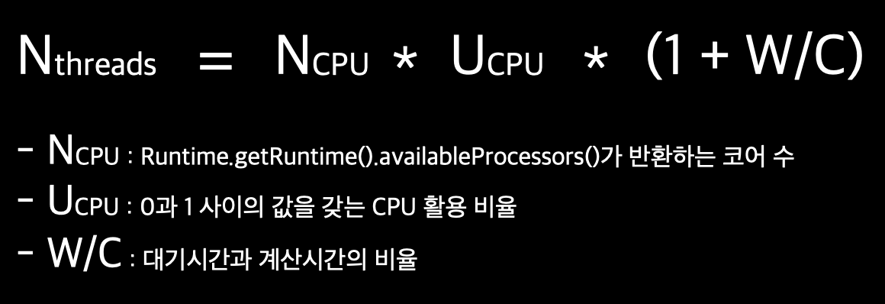

# CompletableFuture : 안정적 비동기 프로그래밍

# Future의 단순 활용

- Future은 계산이 끝났을 때 결과에 접근할 수 있는 참조 제공
- 시간이 걸릴 수 있는 작업을 Future 내부로 설정하면 호출자 스레드가 결과를 기다리는 동안 다른 유용한 작업을 수행할 수 있음
- 시간이 오래 걸리는 작업을 Callable 객체 내부로 감싼 다음 ExecutorService에 제출해야 함

```java
ExecutorService executor = Executors.newCachedThreadPool();
Future<Double> future = executor.submit(new Callable<Double>() {
    @Override
    public Double call() throws Exception {
        return doSomeLongComputation();
        // 시간이 오래 걸리는 작업 비동기적으로 실행
    }
});
doSomethingElse();
try {
    Double result = future.get(1, TimeUnit.SECONDS);
    // 결과가 준비되어 있지만으면 호출 스레드 블록
    // 최대 1초까지만 기다림
} catch (ExecutionException ee) {
    // 계산 중 예외 발생
} catch (InterruptedException ie) {
    // 현재 스레드에서 대기 중 인터럽트 발생
} catch (TimeoutException te) {
    // Future가 완료되기 전에 타임아웃 발생
}
```

## Future 제한

- 여러 Future의 결과가 있을 때 의존성은 표현하기 어려움
  - 오래 걸리는 A라는 계산이 끝나면 그 결과를 다른 오래 걸리는 계산 B로 전달 하시오. 그리고 B의 결과가 나오면 다른 질의의 결과와 그 결과를 다른 오래 걸리는 계산 B로 전달하시오

## CompletableFuture(Future 인터페이스를 구현한 클래스)

- 선언형 기능
- Stream과 비슷한 패턴 : 람다 표현식, 파이프라이닝 활용

## 동기 API와 비동기 API

- `동기 API`
  - 메서드를 호출한 다음 메서드가 계산을 완료할 때까지 기다렸다가 메서드가 반환되면 호출자는 반환된 값으로 계속 다른 동작을 수행
  - 블록 호출(blocking call)
- `비동기 API`
  - 메서드가 즉시 반환되며 끝내지 못한 나머지 작업을 호출자 스레드와 동기적으로 실행될 수 있도록 다른 스레드에 할당
  - 비블록 호출(non-blocking call)

# 비동기 API 구현

```java
public class Shop {
    public double getPrice(String product) {
        return calculatePrice(product);
    }

    private double calculatePrice(String product) {
        delay();
        return new Random().nextDouble() * product.charAt(0) + product.charAt(1);
    }

    public static void delay() {
        try {
            Thread.sleep(1000L); // 비동기 동작이 완료될 때까지 1초 동안 블록
        } catch (InterruptedException e) {
            throw new RuntimeException(e);
        }
    }
}
```

## 동기 메서드를 비동기 메서드로 변환

```java
public Future<Double> getPriceAsync(String product) {
    CompletableFuture<Double> futurePrice = new CompletableFuture<>();
    new Thread(() -> {
        double price = calculatePrice(product); // 다른 스레드에서 비동기적으로 계산 수행
        futurePrice.complete(price); // 오랜 시간이 걸리는 계산이 완료되면 Future에 값 설정 후 종료
    }).start();
    return futurePrice; // 계산 결과가 완료되길 기다리지 않고 Future 반환
}
```

```java
Shop shop = new Shop("BestShop");
long start = System.nanoTime();
Future<Double> futurePrice = shop.getPriceAsync("my favorite product"); // 제품 가격 정보 요청
long invocationTime = (System.nanoTime() - start) / 1_000_000;
System.out.println("Invocation returned after " + invocationTime + " msecs");

doSomethingElse(); // 제품 가격을 계산하는 동안 다른 작업 수행

try {
    double price = futurePrice.get(); // 가격 정보가 있으면 읽고 없으면 받을 때까지 블록
    System.out.printf("Price is %.2f%n", price);
} catch (Exception e) {
    throw new RuntimeException(e);
}

long retrievalTime = (System.nanoTime() - start) / 1_000_000;
System.out.println("Price returned after " + retrievalTime + " msecs");

// Invocation returned after 5 msecs ➡️ 계산이 끝나기 전에 getPriceAsync 반환됨
// 다른 작업 수행
// Price is 124.02
// Price returned after 1039 msecs
```

## 에러 처리 방법

- 예외가 발생하면 해당 스레드에만 영향을 미친다
  - 에러가 발생해도 가격 계산은 계속 진행됨
  - 클라이언트는 get 메서드가 반환될 때까지 영원히 기다릴 수도 있다
  - ➡️ 타임아웃 값을 받는 get 메서드의 오버로드 버전 만들어 해결
  - ➡️ 블록 문제가 발생할 수 있는 상황에서는 타임아웃을 활용하는 것이 좋다 ➡️ 타임아웃 시간이 지나면 TimeoutException 발생
  - 😭 왜 에러가 발생했는지는 알 수 없음
  - ➡️ `completeExceptionally` 메서드 사용

```java
public Future<Double> getPriceAsync(String product) {
    CompletableFuture<Double> futurePrice = new CompletableFuture<>();
    new Thread(() -> {
        try {
        double price = calculatePrice(product);
        futurePrice.complete(price);
        } catch (Exception ex) {
            futurePrice.completeExceptionally(ex); // 에러 발생시 발생한 에러를 포함시켜 Future 종료
        }
    }).start();
    return futurePrice;
}
```

### 팩토리 메서드 supplyAsync로 CompletableFuture 만들기

- 간단하게 CompletableFuture 만들기

```java
public Future<Double> getPriceAsync(String product) {
    return CompletableFuture.supplyAsync(() -> calculatePrice(product));
}
```

- `supplyAsync`
  - Supplier를 인수로 받아 CompletableFuture를 반환

```java
public static <U> CompletableFuture<U> supplyAsync(Supplier<U> supplier) {
    return asyncSupplyStage(ASYNC_POOL, supplier);
    // ASYNC_POOL : ForkJoinPool
}

static <U> CompletableFuture<U> asyncSupplyStage(Executor e,
                                                 Supplier<U> f) {
    if (f == null) throw new NullPointerException();
    CompletableFuture<U> d = new CompletableFuture<U>();
    e.execute(new AsyncSupply<U>(d, f)); // ForkJoinPool의 Executor 중 하나가 Supplier 실행
    return d;
}
```

# 비블록 코드 만들기

```java
private List<Shop> shops = List.of(
        new Shop("BestShop"),
        new Shop("LetsSaveBig"),
        new Shop("MyFavoriteShop"),
        new Shop("BuyItAll"));

// 제품명을 입력하면 상점 이름과 제품 가격 문자열 정보를 포함하는 List 반환
public List<String> findPrices(String product) {
    return shops.stream()
            .map(shop -> String.format("%s price is %.2f",
                    shop.getName(), shop.getPrice(product)))
            .toList();
}
```

```java
long start = System.nanoTime();
System.out.println(findPrices("myPhone27S"));
long duration = (System.nanoTime() - start) / 1_000_000;
System.out.println("Done in " + duration + " msecs");

// [BestShop price is 228.78, LetsSaveBig price is 207.33, MyFavoriteShop price is 121.67, BuyItAll price is 128.53]
// Done in 4064 msecs ➡️ 각 1초 대기 시간 有
```

## 병렬 스트림으로 요청 병렬화하기

- `parallelStream()`

```java
public List<String> findPrices(String product) {
    return shops.parallelStream() // 병렬 스트림
            .map(shop -> String.format("%s price is %.2f",
                    shop.getName(), shop.getPrice(product)))
            .toList();
}

// Done in 1058 msecs
```

# CompletableFuture로 비동기 호출 구현

- CompletableFuture의 `join` 메서드는 Future의 get 메서드와 같은 의미
  - 아무 예외도 발생시키지 않음

```java
public List<String> findPrices(String product) {
    List<CompletableFuture<String>> priceFutures = shops.stream()
            .map(shop -> CompletableFuture.supplyAsync( // 각각의 가격을 비동기적으로 계산
                    () -> String.format("%s price is %.2f",
                            shop.getName(), shop.getPrice(product))))
            .toList();

    return priceFutures.stream()
            .map(CompletableFuture::join) // 모든 비동기 동작이 끝나길 기다림
            .toList();
}
// ✨ 스트림 연산의 게으른 특성 때문에 두 개의 파이프라인으로 처리해야 함
// 하나의 파이프 라인으로 처리 시 : 모든 가격 정보 요청 동작이 동기적, 순차적으로 이루어짐

// Done in 1054 msecs
```

# 더 확장성이 좋은 해결 방법

- 병렬 스트림, CompletableFuture 내부적으로 Runtime.getRuntime().availableProcessors()가 반환하는 스레드 수 사용하며 비슷한 결과가 됨
- CompletableFuture은 다양한 Excutor를 지정할 수 있다
- Excutor로 스레드 풀의 크기를 조절하는 등 애플리케이션에 맞는 최적화된 설정을 만들 수 있다

## 커스텀 Excutor 사용

- 스레드 풀이 너무 크면 CPU와 메모리 자원을 서로 경쟁하느라 낭비할 수 있다
- 스레드 풀이 너무 작으면 CPU의 일부 코어는 활용되지 않을 수 있다

### 스레드 풀 크기 조절



```java
// 상점 수보다 많은 스레드를 가지고 있어도 사용할 가능성 ❌
// 스레드 수가 너무 많으면 서버가 크래시 될 수 있음 (최대 개수 100 이하로 설정)

private final Executor executor =
        // 상점 수만큼 스레드를 갖는 풀 생성(스레드 범위 : 0 ~ 100)
        Executors.newFixedThreadPool(Math.min(shops.size(), 100),
                new ThreadFactory() {
                    @Override
                    public Thread newThread(Runnable r) {
                        Thread t = new Thread(r);
                        t.setDaemon(true); // 프로그램 종료를 방해하지 않는 데몬 스레드 사용
                        return t;
                    }
                });
```

- 자바에서 일반 스레드가 실행 중이면 자바 프로그램은 종료되지 않음
- `데몬 스레드` : 자바 프로그램이 종료될 때 강제로 실행이 종료될 수 있음

```java
public List<String> findPrices(String product) {
    List<CompletableFuture<String>> priceFutures = shops.stream()
            .map(shop -> CompletableFuture.supplyAsync(
                    () -> String.format("%s price is %.2f",
                            shop.getName(), shop.getPrice(product)), executor))
                            // executor를 supplyAsync의 두 번째 인수로 전달
            .toList();

    return priceFutures.stream()
            .map(CompletableFuture::join)
            .toList();
}
```

### Shop이 30개일 때 각 방법 시간 차이

| 방법                                    | 시간 |
| --------------------------------------- | ---- |
| 병렬 스트림                             | 4062 |
| CompletableFuture + executor 커스텀 ❌  | 5071 |
| CompletableFuture + executor 커스텀 ⭕️ | 1061 |

- 애플리케이션의 특성에 맞는 Executor를 만들어 CompletableFuture를 활용하는 것이 바람직

### 스트림 병렬화 vs CompletableFuture

- I/O가 포함되지 않은 계산 중심의 동작 실행 ➡️ 스트림 인터페이스가 구현하기 간단하며 효율적
- I/O를 기다리는 작업을 병렬로 실행할 때 CompletableFuture가 더 많은 유연성을 제공하며 대기/계산(W/C)의 비율에 적합한 스레드 수를 설정할 수 있음

# 비동기 작업 파이프라인 만들기

```java
package chap16;

import chap16.Discount.Code;
import java.util.Random;
import java.util.concurrent.CompletableFuture;
import java.util.concurrent.Future;

public class Shop {
    private final String name;
    private final Random random;


    public Shop(String name) {
        this.name = name;
        random = new Random(name.charAt(0) * name.charAt(1) * name.charAt(2));
    }

    public Future<Double> getPriceAsync(String product) {
        return CompletableFuture.supplyAsync(() -> calculatePrice(product));
    }

    private double calculatePrice(String product) {
        delay();
        return random.nextDouble() * product.charAt(0) + product.charAt(1);
    }

    public static void delay() {
        try {
            Thread.sleep(1000L); // 비동기 동작이 완료될 때까지 1초 동안 블록
        } catch (InterruptedException e) {
            throw new RuntimeException(e);
        }
    }

    public String getName() {
        return name;
    }

    public String getPrice(String product) {
        double price = calculatePrice(product);
        Discount.Code code = Discount.Code.values()[random.nextInt(Code.values().length)];
        return String.format("%s:%.2f:%s", name, price, code);
    }
}
```

```java
public class Discount {
    public enum Code {
        NONE(0), SILVER(5), GOLD(10), PLATINUM(15), DIAMOND(20);

        private final int percentage;

        Code(int percentage) {
            this.percentage = percentage;
        }
    }

    public static String applyDiscount(Quote quote) {
        return quote.getShopName() + " price is "
                + Discount.apply(quote.getPrice(), quote.getDiscountCode());
    }

    private static double apply(double price, Code code) {
        delay();
        return price * (100 - code.percentage) / 100;
    }

    public static void delay() {
        try {
            Thread.sleep(1000L);
        } catch (InterruptedException e) {
            throw new RuntimeException(e);
        }
    }
}
```

```java
System.out.println(new Shop("BestPrice").getPrice("my favorite product"));
// BestPrice:123.26:GOLD
```

## 할인 서비스 구현

```java
public class Quote {
    private final String shopName;
    private final double price;
    private final Discount.Code discountCode;

    private Quote(String shopName, double price, Discount.Code code) {
        this.shopName = shopName;
        this.price = price;
        this.discountCode = code;
    }

    public static Quote parse(String s) {
        String[] split = s.split(":");
        String shopName = split[0];
        double price = Double.parseDouble(split[1]);
        Discount.Code discountCode = Discount.Code.valueOf(split[2]);
        return new Quote(shopName, price, discountCode);
    }

    public String getShopName() {
        return shopName;
    }

    public double getPrice() {
        return price;
    }

    public Discount.Code getDiscountCode() {
        return discountCode;
    }
}
```

## 할인 서비스 사용

```java
public List<String> findPrices(String product) {
    return shops.stream()
            .map(shop -> shop.getPrice(product)) // 5초 소요
            .map(Quote::parse)
            .map(Discount::applyDiscount) // 5초 소요
            .toList();
}

// [BestShop price is 110.934, LetsSaveBig price is 135.576, MyFavoriteShop price is 192.717, BuyItAll price is 184.74, ShopEasy price is 167.276]
// Done in 10104 msecs
```

## 동기 작업과 비동기 작업 조합하기

- CompletableFuture
  - `thenApply`
    - 앞선 작업의 결과를 받아서 해당 결과에 함수를 적용하고, 그 결과를 새로운 CompletableFuture로 반환
    - CompletableFuture가 끝날 때까지 블록하지 않음
    - ➡️ CompletableFuture가 동작을 완전히 완료한 다음에 전달된 람다식을 적용할 수 있음
  - `thenCompose`
    - 두 비동기 연산을 파이프라인으로 만들 수 있도록 함
    - 첫 번째 연산의 결과를 두 번째 연산으로 전달
    - (두 CompletableFuture 조합)
    - 이전 작업을 수행한 스레드와 같은 스레드에서 작업 실행
    - thenComposeAsync보다 스레드 전환 오버헤드가 적게 발생하면서 효율성이 더 좋음
    - `thenComposeAsync` : 다음 작업이 다른 스레드에서 실행되도록 스레드 풀로 작업 제출

```java
public List<String> findPrices(String product) {
    List<CompletableFuture<String>> priceFutures = shops.stream()
            .map(shop -> CompletableFuture.supplyAsync( // 작업 1 비동기
                    () -> shop.getPrice(product), executor))
            .map(future -> future.thenApply(Quote::parse))
            // 원격 서비스나 I/O가 없으므로 원하는 즉시 지연 없이 동작 수행 가능
            // CompletableFuture<String> ➡️ CompletableFuture<Quote>
            .map(future -> future.thenCompose(quote ->
            // 첫 번째 CompletableFuture에 의존하기 때문에 thenComposeAsync를 사용해도 실행 시간에 영향 미치지 않음
                    CompletableFuture.supplyAsync( // 작업 2 비동기
                            () -> Discount.applyDiscount(quote), executor)))
            .toList();

    return priceFutures.stream()
            .map(CompletableFuture::join)
            .toList();
}

// Done in 2088 msecs
```

## 독립 CompletableFuture와 비독립 CompletableFuture 합치기

- `thenCombine`
  - BiFunction을 두 번째 인수로 받음 : 두 개의 CompletableFuture 결과를 어떻게 합칠지 정의
- `thenCombineAsync`
  - BiFunction이 정의하는 조합 동작이 스레드 풀로 제출되면서 별도의 태스크에서 비동기적으로 수행

```java
public class ExchangeService {
    public static final double DEFAULT_RATE = 1.35;

    public enum Money {
        USD(1.0), EUR(1.35387), GBP(1.69715), CAD(.92106), MXN(.07683);

        private final double rate;

        Money(double rate) {
            this.rate = rate;
        }
    }

    public static double getRate(Money source, Money destination) {
        return getRateWithDelay(source, destination);
    }

    private static double getRateWithDelay(Money source, Money destination) {
        delay();
        return destination.rate / source.rate;
    }

    public static void delay() {
        try {
            Thread.sleep(1000L);
        } catch (InterruptedException e) {
            throw new RuntimeException(e);
        }
    }
}
```

```java
public double getPriceDouble(String product) {
    return calculatePrice(product);
}
```

```java
CompletableFuture<Double> futurePriceInUSD =
        CompletableFuture.supplyAsync(() -> shop.getPriceDouble("my favorite product")) // 첫 번째 태스크
                .thenCombine( // 단순한 곱셈이므로 Async 버전 사용하여 자원 낭비할 필요 없음
                        CompletableFuture.supplyAsync(
                                () -> ExchangeService.getRate(Money.EUR, Money.USD)), // 두 번째 태스크
                        (price, rate) -> price * rate // 첫 번째 결과와 두 번째 결과를 조합하는 방법
                );
```

## Future의 리플렉션과 CompletableFuture의 리플렉션

```java
ExecutorService executor = Executors.newCachedThreadPool();
final Future<Double> futureRate = executor.submit(new Callable<Double>() {
    @Override
    public Double call() throws Exception {
        return ExchangeService.getRate(Money.EUR, Money.USD);
    }
});
Future<Double> futurePriceInUSD2 = executor.submit(new Callable<Double>() {
    @Override
    public Double call() throws Exception {
        double priceInEUR = shop.getPriceDouble("my favorite product");
        return priceInEUR * futureRate.get();
    }
});
```

- CompletableFuture이 없을 때 버전을 통해 람다 표현식을 사용함으로써 복잡한 연산 수행을 효과적으로 정의할 수 있는 선언형 API의 가독성 확인 가능

## 타임아웃 효과적으로 사용하기

- Future의 계산 결과를 읽을 때는 무한정 기다리는 상황이 발생할 수 있음
- CompletableFuture 기능을 통해 해결

### `orTimeout`

- 지정된 시간이 지난 후에 CompletableFuture를 TimeoutException으로 완료하면서 또 다른 CompletableFuture를 반환할 수 있도록 내부적으로 ScheduledThreadExecutor 활용
- 계산 파이프라인을 연결하고 TimeoutException이 발생했을 때 사용자가 쉽게 이해할 수 있는 메시지 제공 가능

```java
CompletableFuture<Double> futurePriceInUSD =
        CompletableFuture.supplyAsync(() -> shop.getPriceDouble("my favorite product"))
                .thenCombine(
                        CompletableFuture.supplyAsync(
                                () -> ExchangeService.getRate(Money.EUR, Money.USD)),
                        (price, rate) -> price * rate
                )
                .orTimeout(3, TimeUnit.SECONDS); // 3초 뒤에 작업이 완료되지 않으면 TimeoutException 발생
```

### `completeOnTimeout`

- 일시적으로 서비스를 이용할 수 없는 상황에서 서버에서 얻은 값이 아닌 미리 지정된 값(기본값)을 사용

```java
CompletableFuture<Double> futurePriceInUSD =
        CompletableFuture.supplyAsync(() -> shop.getPriceDouble("my favorite product"))
                .thenCombine(
                        CompletableFuture.supplyAsync(
                                () -> ExchangeService.getRate(Money.EUR, Money.USD))
                                // 1초 안에 ExchangeService.getRate의 결과가 제공되지 않으면 기본 환율값 사용
                                .completeOnTimeout(ExchangeService.DEFAULT_RATE, 1, TimeUnit.SECONDS),
                        (price, rate) -> price * rate
                )
                .orTimeout(3, TimeUnit.SECONDS);
```

# CompletableFuture의 종료에 대응하는 방법

- 이용할 수 있는 정보는 즉시 사용자에게 보여줄 수 있도록 대응

```java
// 랜덤 지연 사용
private static final Random random = new Random();

public static void randomDelay() {
    int delay = 500 + random.nextInt(2000);
    try {
        Thread.sleep(delay);
    } catch (InterruptedException e) {
        throw new RuntimeException(e);
    }
}
```

## 최저가격 검색 애플리케이션 리팩터링

- 모든 가격 정보를 포함할 때까지 리스트 생성을 기다리지 않도록 프로그램을 고쳐야 함

```java
// 스트림 직접 제어 할 수 있도록 findPrices 리팩터링
// 단순히 CompletableFuture에 동작 "등록"
public Stream<CompletableFuture<String>> findPricesStream(String product) {
    return shops.stream()
            .map(shop -> CompletableFuture.supplyAsync(
                    () -> shop.getPrice(product), executor))
            .map(future -> future.thenApply(Quote::parse))
            .map(future -> future.thenCompose(quote ->
                    CompletableFuture.supplyAsync(
                            () -> Discount.applyDiscount(quote), executor)));
}
```

- `thenAccept`
  - CompletableFuture의 계산이 끝나면 값을 소비
  - 연산 결과를 소비하는 Consumer를 인수로 받음 ➡️ 바로 바로 소비
  - CompletableFuture\<Void> 반환

```java
priceFinder.findPricesStream("myPhone")
                .map(f -> f.thenAccept(System.out::println))
```

### 가장 느린 상점에서 응답을 받아서 반환된 가격을 출력할 기회를 제공

- 실행 결과 기다려야 함

```java
CompletableFuture[] futures = priceFinder.findPricesStream("myPhone")
        .map(f -> f.thenAccept(System.out::println))
        .toArray(CompletableFuture[]::new);

CompletableFuture.allOf(futures).join();
// CompletableFuture.anyOf(futures1).join();
```

- `allOf`
  - CompletableFuture\<Void> 반환
  - 반환된 CompletableFuture에 join을 호출하면 원래 스트림의 모든 실행 완료를 기다림
- `anyOf`
  - 처음으로 완료한 CompletableFuture의 값으로 동작을 완료

## 응용

```java
long start = System.nanoTime();
CompletableFuture[] futures = priceFinder.findPricesStream("myPhone27S")
       .map(f -> f.thenAccept(
               s -> System.out.println(s + " (done in " + ((System.nanoTime() - start) / 1_000_000) + " msecs)")))
       .toArray(CompletableFuture[]::new);
CompletableFuture.allOf(futures).join();
System.out.println("All shops have now responded in " + (System.nanoTime() - start) / 1_000_000 + " msecs");
```

```bash
# 마지막 가격 정보에 비해 처음 가격 정보를 두 배 빨리 얻을 수 있었음
ShopEasy price is 167.276 (done in 1681 msecs)
BuyItAll price is 184.74 (done in 1681 msecs)
BestShop price is 110.934 (done in 1936 msecs)
LetsSaveBig price is 135.576 (done in 2221 msecs)
MyFavoriteShop price is 192.717 (done in 2226 msecs)
All shops have now responded in 2226 msecs
```
