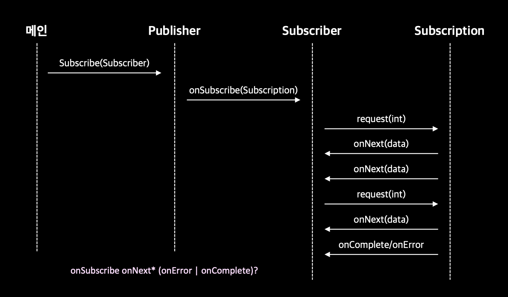
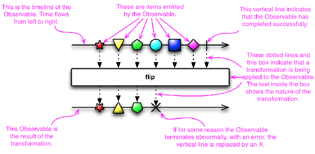
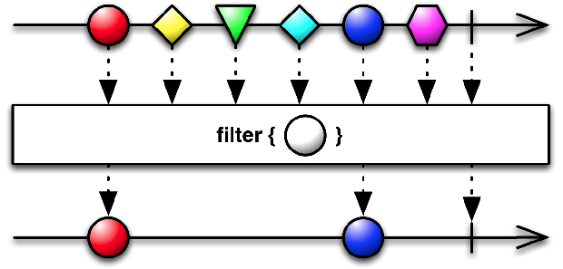

# 리액티브 프로그래밍

- 리액티브 프로그래밍에서는 다양한 시스템과 소스에서 들어오는 데이터 항목 스트림을 비동기적으로 처리하고 합쳐서 문제 해결
  - 발생한 데이터 항목을 바로 처리하여 사용자에게 높은 응답성 제공
  - 전체의 리액티브 시스템을 구성하는 여러 컴포넌트를 조절하는 데도 리액티브 기법 사용 가능
  - 고장, 정전 상태에 대처 ➕ 다양한 네트워크 상태에서 메시지 교환, 전달
  - 무거운 작업을 하고 있는 상황에서도 가용성 제공

# 리액티브 매니패스토

- 리액티브 애플리케이션과 시스템 개발의 핵심 원칙

### 반응성(responsive)

- 일정하고 예상할 수 있는 반응 시간 제공(적정 시간 안에 반응)
- 사용자의 확신이 증가하면서 사용할 수 있는 애플리케이션이라는 확인 제공

### 회복성(resilient)

- 장애가 발생해도 시스템은 반응
- 컴포넌트 실행 복제, 여러 컴포넌트의 시간(발송자와 수신자가 독립적인 생명 주기를 가짐)과 공간(발송자와 수신자가 다른 프로세스에서 실행) 분리, 각 컴포넌트가 비동기적으로 다른 컴포넌트에 작업 위임 ...
- 컴포넌트에서 발생한 장애를 고립 ➡️ 문제가 주변의 다른 컴포넌트로 전파되면서 전체 시스템 장애로 이어지는 것을 막음

### 탄력성(elastic)

- 작업 부하가 발생하면 자동으로 관련 컴포넌트에 할당된 자원 수를 늘림
- 다양한 작업 부하에도 시스템 반응성이 유지

### 메시지 주도(Message-driven)

- 비동기 메시지를 전달해 컴포넌트들이 서로 통신
- 메시지 주도를 통해 회복성(장애 메시지로 처리) ➕ 탄력성(주고 받은 메시지 수 감시, 메시지의 양에 따라 적절하게 리소스 할당)을 얻을 수 있음
- 비동기 메시지 전달에 의존하여 컴포넌트 간의 약한 결합, 고립, 위치 투명성이 유지

## 애플리케이션 수준의 리액티브 - 리액티브 애플리케이션

- 주요 기능 : 비동기로 작업 수행
- 비교적 짧은 시간 동안만 유지되는 데이터 스트림에 기반한 연산 수행
- `이벤트 주도` : 이벤트를 관찰하도록 등록된 컴포넌트가 수신
- 이벤트 스트림을 블록하지 않고 비동기로 처리하는 것이 최신 멀티코어 CPU의 사용률을 극대화
- 스레드(상대적으로 비싸고 희귀한 자원)를 퓨처, 액터, 일련의 콜백을 발생시키는 이벤트 루프등과 공유하고 처리할 이벤트를 변환하고 관리
- 동기, 비동기 애플리케이션의 추상 수준을 높일 수 있으므로 동기 블록, 경쟁 조건 데드락 같은 저 수준의 멀티스레드 문제를 직접 처리할 필요가 없어짐 ➡️ 비즈니스 요구사항을 구현하는 데 더 집중
- CPU 관련 작업과 I/O 관련 작업을 분리하면 정밀하게 풀의 크기 등을 설정할 수 있고 두 종류의 작업의 성능을 관찰할 수 있음
- 리액티브 시스템을 만드려면 훌륭하게 설계된 리액티브 애플리케이션 집합이 서로 잘 조화를 이루게 해야 함
- `시간`에 기반한 비동기, 동시적, 비결합

## 시스템 수준의 리액티브 - 리액티브 시스템

- 애플리케이션을 조립하고 상호소통을 조절
- `메시지 주도` : 정의된 목적지 하나
- 여러 애플리케이션이 한 개의 일관적인, 회복할 수 있는 플랫폼을 구성할 수 있게 함
- 여러 애플리케이션 중 하나가 실패해도 전체 시스템은 계속 운영될 수 있도록 도와주는 소프트웨어 아키텍처
- 수신자와 발신자가 각각 수신 메시지, 발신 메시지와 결합하지 않도록 메시지를 비동기로 처리해야 함
- 문제를 격리하여 에러 전파를 방지하고 메시지로 바꾸어 다른 컴포넌트로 보내는 등 감독자 역할을 수행
  - 컴포넌트 자체로 문제가 한정, 외부로는 안전성 보장
- `위치 투명성`을 통한 공간적 비결합
  - 리액티브 시스템의 모든 컴포넌트가 수신자의 위치에 상관없이 다른 모든 서비스와 통신할 수 있음
  - 시스템 복제 가능
  - 현재 작업 부하에 따라 애플리케이션 확장 가능

# 리액티브 스트림과 플로 API

- 리액티브 스트림 : 잠재적으로 무한의 비동기 데이터를 순서대로, 블록하지 않는 역압력을 전제해 처리하는 표준 기술
  - `역압력` : 발행-구독 프로토콜에서 발행자가 이벤트를 제공하는 속도보다 느린 속도로 소비하면서 문제가 발생하지 않도록 보장하는 장치
- 부하가 발생한 컴포넌트는 이벤트 발행 속도를 늦추라고 알리거나, 얼마나 많은 이벤트를 수신할 수 있는지 알리거나, 다른 데이터를 받기 전에 기존의 데이터를 처리하는 데 얼마나 시간이 걸리는지를 업스트림 발행자에게 알릴 수 있어야 함
- 역압력이나 제어 흐름 기법을 통해 데이터 수신자가 스레드를 블록하지 않으면서도 처리할 수 없을만큼 많은 데이터를 받는 일을 방지하는 프로토콜을 제공

## Flow 클래스 소개

- uninstantiable 인스턴스화 할 수 없음
- 중첩된 인터페이스 네 개를 포함
  - Publisher : 이벤트 발행
  - Subscriber : 이벤트 소비, Subscriber의 요구 사항에 따라 역압력 기법에 의해 이벤트 제공 속도 제한
  - Subscription : Publisher와 Subscriber 사이의 제어 흐림, 역압력 관리
  - Processor

```java
public final class Flow {

    private Flow() {} // uninstantiable

    @FunctionalInterface
    public static interface Publisher<T> {
        public void subscribe(Subscriber<? super T> subscriber);
    }

    public static interface Subscriber<T> {
        // 콜백 메서드
        // onSubscribe onNext* (onError | onComplete)? 순서로 호출되어야 함
        // onSubscibe 항상 먼저
        // onNext 여러 번 호출될 수 있음
        public void onSubscribe(Subscription subscription);
        public void onNext(T item);
        public void onError(Throwable throwable); // Publisher에 장애가 발생 했을 때
        public void onComplete(); // 더 이상의 데이터가 없고 종료됨
    }

    public static interface Subscription {
        public void request(long n); // Publisher에게 주어진 개수의 이벤트를 처리할 준비가 되었음을 알림
        public void cancel(); // subscription 취소(구독 취소)
    }

    // Subscriber, Publisher 상속만 받음
    public static interface Processor<T,R> extends Subscriber<T>, Publisher<R> {
    }

    static final int DEFAULT_BUFFER_SIZE = 256;
    public static int defaultBufferSize() {
        return DEFAULT_BUFFER_SIZE;
    }
}
```

- Subscriber가 Publisher에 subscribe ➡️ onSubscribe를 호출해 Subscription 객체 전달
- 인터페이스에 정의된 모든 메서드가 void를 반환
  - 비동기 방식으로 구현해야 함

### Flow 인터페이스 구현 규칙

- Publisher는 Subscriptionb의 request 메서드에 정의된 개수 이하의 요소만 Subscriber에 전달
  - Publisher는 지정된 개수보다 적은 수의 요소를 onNext로 전달할 수 있음
  - 동작이 성공적으로 끝나면 onComplete 호출
  - 문제가 발생하면 onError 호출해 Subscription 종료
- Subscriber는 요소를 받아 처리할 수 있음을 Publisher에 알려야 함(Subscriber ➡️ Publisher 역압력 행사)
  - onComplete나 onError 신호를 처리하는 상황에서 Publisher나 Subscription의 어떤 메서드도 호출할 수 없고 Subscription이 취소되었다고 가정해야 함
  - Subscription.request() 메서드 호출 없이도 언제든 종료 시그널을 받을 준비가 되어야 함
  - Subscription.cancel() 호출 이후에도 한 개 이상의 onNext를 받을 준비가 되어 있어야 함
- Publisher와 Subscriber는 정확하게 Subscription을 공유하며 각각이 고유한 역할을 수행
  - Subscriber는 onSubscribe, onNext 메서드에서 Subscription.request()를 동기적으로 호출할 수 있어야 함
  - Subscription.cancel() 메서드는 몇 번을 호출해도 한 번 호출한 것과 같은 효과를 가져야 함



## 리액티브 애플리케이션 만들기

- java.util.concurrency.Flow 명세 : 라이브러리가 준수해야 할 규칙과 다양한 리액티브 라이브러리를 이용해 개발된 리액티브 애플리케이션이 서로 협동하고 소통할 수 있는 공용어를 제시

```java
public class TempInfo {
    public static final Random random = new Random();

    private final String town;
    private final int temp;

    private TempInfo(String town, int temp) {
        this.town = town;
        this.temp = temp;
    }

    public static TempInfo fetch(String town) {
        if (random.nextInt(10) == 0) { // 10분의 1 확률로 온도 가져오기 작업 실패
            throw new RuntimeException("Error!");
        }
        return new TempInfo(town, random.nextInt(100)); // 0에서 99 사이 임의의 화씨 온도 반환
    }

    @Override
    public String toString() {
        return town + " : " + temp;
    }
}
```

```java
public class TempSubscription implements Subscription {
    private final Subscriber<? super TempInfo> subscriber;
    private final String town;

    public TempSubscription(Subscriber<? super  TempInfo> subscriber, String town) {
        this.subscriber = subscriber;
        this.town = town;
    }

    @Override
    public void request(long n) {
        for (long i = 0L; i < n; i++) {
            try {
                subscriber.onNext(TempInfo.fetch(town));
            } catch (Exception e) {
                subscriber.onError(e);
                break;
            }
        }
    }

    @Override
    public void cancel() {
        subscriber.onComplete(); // 구독 취소되면 onComplete 전달
    }
}
```

```java
public class TempSubscriber implements Subscriber<TempInfo> {
    private Subscription subscription;

    @Override
    public void onSubscribe(Subscription subscription) {
        this.subscription = subscription;
        subscription.request(1);
    }

    @Override
    public void onNext(TempInfo tempInfo) {
        System.out.println(tempInfo);
        subscription.request(1);
    }

    @Override
    public void onError(Throwable t) {
        System.err.println(t.getMessage());
    }

    @Override
    public void onComplete() {
        System.out.println("Done!");
    }
}
```

```java
public class Main {
    public static void main(String[] args) {
        getTemperatures("New York").subscribe(new TempSubscriber());
        // Publisher를 만들고 구독
    }

    private static Publisher<TempInfo> getTemperatures(String town) {
        // 구독한 Subscriber에게 subscription을 전송하는 Publisher 반환
        return subscriber -> subscriber.onSubscribe(
                new TempSubscription(subscriber, town));
                // 함수형 인터페이스 Publisher의 subscribe 메서드와 같은 시그니처
                // ➡️ 자바 컴파일러가 자동으로 Publisher로 바꿈
    }
}
```

### TempInfo에서 임의로 에러를 발생시키지 않으면 스택 오버플로 발생

```java
// 📁 TempSubscription

// executor 추가
private static final ExecutorService executor = Executors.newSingleThreadExecutor();

@Override
public void request(long n) {
    executor.submit(() -> { // 다른 스레드에서 다음 요소를 구독자에게 보냄
        for (long i = 0L; i < n; i++) {
            try {
                subscriber.onNext(TempInfo.fetch(town));
            } catch (Exception e) {
                subscriber.onError(e);
                break;
            }
        }
    });
}
```

## Processor로 데이터 변환

- Processor의 목적 : Publisher를 구독한 다음 수신한 데이터를 가공해 다시 제공

```java
public class TempProcessor implements Processor<TempInfo, TempInfo> {
    private Subscriber<? super  TempInfo> subscriber;

    // 업스트림 Subscriber를 Processor로 등록
    @Override
    public void subscribe(Subscriber<? super TempInfo> subscriber) {
        this.subscriber = subscriber;
    }

    @Override
    public void onNext(TempInfo temp) {
        subscriber.onNext(new TempInfo(temp.getTown(),
                (temp.getTemp() - 32) * 5 / 9)); // 섭씨로 변환한 다음 TempInfo 다시 전송
    }

    // 업스트림 구독자에 신호 전달
    @Override
    public void onSubscribe(Subscription subscription) {
        subscriber.onSubscribe(subscription);
    }

    @Override
    public void onError(Throwable throwable) {
        subscriber.onError(throwable);
    }

    @Override
    public void onComplete() {
        subscriber.onComplete();
    }
}
```

```java
private static Publisher<TempInfo> getCelsiusTemperatures(String town) {
    return subscriber -> {
        TempProcessor processor = new TempProcessor();
        processor.subscribe(subscriber);
        processor.onSubscribe(new TempSubscription(processor, town));
    };
}
```

```java
public static void main(String[] args) {
    getCelsiusTemperatures("New York")
            .subscribe(new TempSubscriber());
}
```

## 자바는 왜 플로 API 구현을 제공하지 않는가?

- API를 만들 당시 Akka, RxJava 등 다양한 리액티브 스트림의 자바 코드 라이브러리가 이미 존재했기 때문
- java.util.concurrent.Flow 인터페이스를 기반으로 이런 라이브러리가 리액티브 개념을 구현하도록 진화
- ➡️ 다양한 라이브러리가 쉽게 협력할 수 있게 됨

# 리액티브 라이브러리 RxJava 사용하기

- 천 개 이하의 요소를 가진 스트림이나 마우스 움직임, 터치 이벤트 등 GUI 이벤트, 자주 발생하지 않는 종류의 이벤트에 역압력 적용하지 말 것을 권장

## Observable 만들고 사용하기

- 역압력을 지원하지 않는 버전 : request 메서드 없음
- 단순한 프로그램, 마우스 움직임 같은 사용자 인터페이스 이벤트에 더 적합
- 역압력 지원 버전 : io.reactivex.Flowable

### `just` 팩토리 메서드

- 한 개 이상의 요소를 이용해 이를 방출하는 Observable로 변환

```java
Observable<String> strings = Observable.just("first", "second");
// Observable의 구독자는 onNext("first"), onNext("second"), onComplete() 순서로 메세지 받음
```

### `interval` 팩토리 메서드

- 사용자와 실시간으로 상호작용하면서 지정된 속도로 이벤트를 방출하는 상황

```java
Observable<Long> onePerSec = Observable.interval(1, TimeUnit.SECONDS);
// 0에서 시작해 1초 간격으로 long 형식의 값을 무한으로 증가시키며 값 방출
```

```java
public interface Observer<@NonNull T> {

    void onSubscribe(@NonNull Disposable d);
    void onNext(@NonNull T t);
    void onError(@NonNull Throwable e);
    void onComplete();
}
```

- 자바 네이티브 플로 API보다 유연(오버로드된 많은 기능 제공)
  - onNext 메서드의 시그니처에 해당하는 람다 표현식을 전달해 Observable을 구독할 수 있다

```java
onePerSec.subscribe(i -> System.out.println(TempInfo.fetch("New York")));
// Observable 초당 한 개의 이벤트 방출하며 메세지 수신
// ➡️ Subscriber가 뉴욕의 온도 추출해 출력
// RxJavad의 연산 스레드 풀(데몬 스레드)에서 실행
```

- `blockingSubscribe` : 현재 스레드에서 콜백 호출

```java
onePerSec.blockingSubscribe(
        i -> System.out.println(TempInfo.fetch("New York"))
);
```

### 사용자에게 팩토리 메서드 제공 ➡️ 매 초마다 온도 방출하는 Observable 반환

```java
public static Observable<TempInfo> getTemperature(String town) {
    return Observable.create(emitter -> {
        Observable.interval(1, TimeUnit.SECONDS)
                .subscribe(i -> {
                  // emitter = ObservableEmitter
                    if (!emitter.isDisposed()) { // 소비된 옵저버가 아직 폐기되지 않았으면 작업 수행
                        if (i >= 5) { // 편의상 최대 다섯 번 방출 후 종료
                            emitter.onComplete();
                        } else {
                            try {
                                emitter.onNext(TempInfo.fetch(town)); // 온도 Observer로 보고
                            } catch (Exception e) {
                                emitter.onError(e);
                            }
                        }
                    }
                });
    });
}
```

```java
// onSubscribe가 빠진 Observer
public interface Emitter<@NonNull T> {

    void onNext(@NonNull T value);
    void onError(@NonNull Throwable error);
    void onComplete();
}
```

```java
public interface ObservableEmitter<@NonNull T> extends Emitter<T> {

    void setDisposable(@Nullable Disposable d);
    void setCancellable(@Nullable Cancellable c);
    boolean isDisposed(); // 소비된 Observer가 이미 폐기되었는지 확인
    @NonNull
    ObservableEmitter<T> serialize();
    boolean tryOnError(@NonNull Throwable t);
}

```

- Observable에 가입시킬 Observer

```java
public class TempObserver implements Observer<TempInfo> {
    @Override
    public void onComplete() {
        System.out.println("Done!");
    }

    @Override
    public void onError(@NonNull Throwable e) {
        System.out.println("Got problem: " + e.getMessage());
    }

    @Override
    public void onSubscribe(@NonNull Disposable d) {

    }

    @Override
    public void onNext(@NonNull TempInfo tempInfo) {
        System.out.println(tempInfo);
    }
}
```

```java
public static void main(String[] args) {
    Observable<TempInfo> observable = getTemperature("New York");
    observable.blockingSubscribe(new TempObserver());
}

// New York : 22
// New York : 88
// New York : 84
// New York : 99
// New York : 16
// Done!
```

## Observable 변환하고 합치기

- 스트림에서 관ㅅ님 있는 요소만 거린 다른 스트림을 만들거나
- 매핑 함수로 요소를 변환하거나
- 두 스트림을 다양한 방법으로 합치는 등 작업을 할 수 있음



- `map` : Observable을 받아 변경한 후 또 다른 Observable 반환

```java
public static Observable<TempInfo> getCelsiusTemperature(String town)  {
    return getTemperature(town)
            .map(temp -> new TempInfo(temp.getTown(), (temp.getTemp() - 32) * 5 / 9));
}
```


- `filter`

```java
public static Observable<TempInfo> getNegativeTemperature(String town) {
    return getCelsiusTemperature(town)
            .filter(temp -> temp.getTemp() < 0);
}
```



- `merge` : Observable의 Iterable을 인수로 받아 한 개의 Observable처럼 동작하도록 결과를 합침

```java
public static Observable<TempInfo> getCelsiusTemperature(String... towns) {
    return Observable.merge(Arrays.stream(towns)
            .map(TempObservable::getCelsiusTemperature)
            .toList());
}
```

```java
Observable<TempInfo> observable = getCelsiusTemperature("New York", "Chicago", "San Francisco");
observable.blockingSubscribe(new TempObserver());

// New York : 10
// Chicago : -8
// San Francisco : 24
// Chicago : -6
// New York : 6
// San Francisco : 29
// Chicago : 35
// New York : 27
// San Francisco : -17
// New York : 27
// Chicago : -9
// San Francisco : 29
// San Francisco : -1
// New York : -3
// Chicago : 4
```
