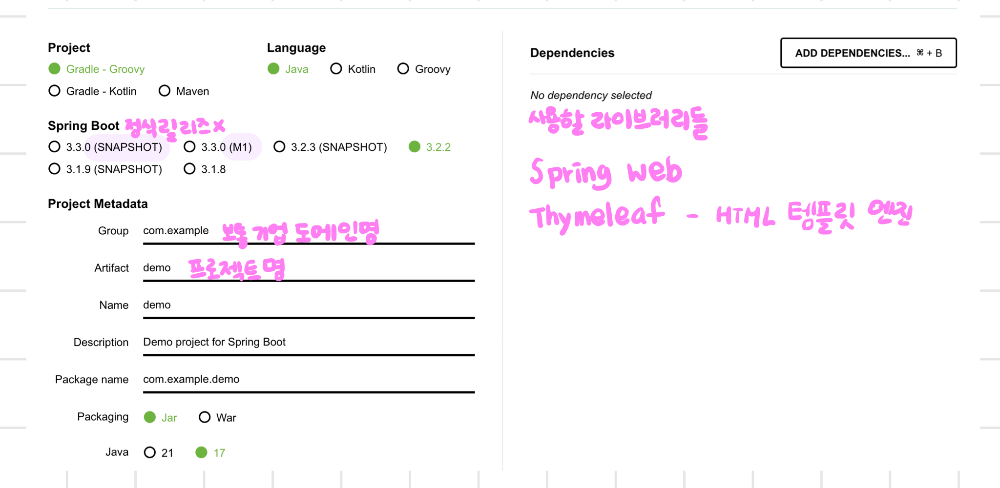

# 스프링 프로젝트 생성

- [스프링 부트 스타터](https://start.spring.io)
  

## 프로젝트 구조

```bash
.
└── hello-spring
    ├── HELP.md
    ├── build.gradle
    ├── gradle
    │   └── wrapper
    │       ├── gradle-wrapper.jar
    │       └── gradle-wrapper.properties
    ├── gradlew
    ├── gradlew.bat
    ├── settings.gradle
    └── src
        ├── main
        │   ├── java
        │   │   └── hello
        │   │       └── hellospring
        │   │           └── HelloSpringApplication.java
        │   └── resources # 자바 파일 제외한 나머지
        │       ├── application.properties
        │       ├── static
        │       └── templates
        └── test
            └── java
                └── hello
                    └── hellospring
                        └── HelloSpringApplicationTests.java
```

## build.gradle

```gradle
plugins {
    id 'java'
    id 'org.springframework.boot' version '3.2.2'
    id 'io.spring.dependency-management' version '1.1.4'
}

group = 'hello'
version = '0.0.1-SNAPSHOT'

java {
    sourceCompatibility = '17'
}

repositories {
    mavenCentral() // 라이브러리 다운 받는 경로
}

dependencies {
    implementation 'org.springframework.boot:spring-boot-starter-thymeleaf'
    implementation 'org.springframework.boot:spring-boot-starter-web'
    testImplementation 'org.springframework.boot:spring-boot-starter-test'
}

tasks.named('test') {
    useJUnitPlatform()
}
```

## main 실행

```java
@SpringBootApplication
public class HelloSpringApplication {

    public static void main(String[] args) {
        SpringApplication.run(HelloSpringApplication.class, args);
    }
    // 내장된 tomcat 웹 서버를 자체적으로 띄우면서 spring boot가 같이 올라감

}
```

```bash
2024-02-12T21:16:12.316+09:00  INFO 37759 --- [           main] h.hellospring.HelloSpringApplication     : Starting HelloSpringApplication using Java 17.0.10 with PID 37759 (/Users/minjoo/workspace/JavaWorkspace/springInfrenBasic/hello-spring/build/classes/java/main started by minjoo in /Users/minjoo/workspace/JavaWorkspace/springInfrenBasic/hello-spring)
2024-02-12T21:16:12.322+09:00  INFO 37759 --- [           main] h.hellospring.HelloSpringApplication     : No active profile set, falling back to 1 default profile: "default"
2024-02-12T21:16:13.242+09:00  INFO 37759 --- [           main] o.s.b.w.embedded.tomcat.TomcatWebServer  : Tomcat initialized with port 8080 (http)
2024-02-12T21:16:13.265+09:00  INFO 37759 --- [           main] o.apache.catalina.core.StandardService   : Starting service [Tomcat]
2024-02-12T21:16:13.265+09:00  INFO 37759 --- [           main] o.apache.catalina.core.StandardEngine    : Starting Servlet engine: [Apache Tomcat/10.1.18]
2024-02-12T21:16:13.318+09:00  INFO 37759 --- [           main] o.a.c.c.C.[Tomcat].[localhost].[/]       : Initializing Spring embedded WebApplicationContext
2024-02-12T21:16:13.320+09:00  INFO 37759 --- [           main] w.s.c.ServletWebServerApplicationContext : Root WebApplicationContext: initialization completed in 930 ms
2024-02-12T21:16:13.656+09:00  INFO 37759 --- [           main] o.s.b.w.embedded.tomcat.TomcatWebServer  : Tomcat started on port 8080 (http) with context path ''
2024-02-12T21:16:13.665+09:00  INFO 37759 --- [           main] h.hellospring.HelloSpringApplication     : Started HelloSpringApplication in 1.693 seconds (process running for 2.448)
```
