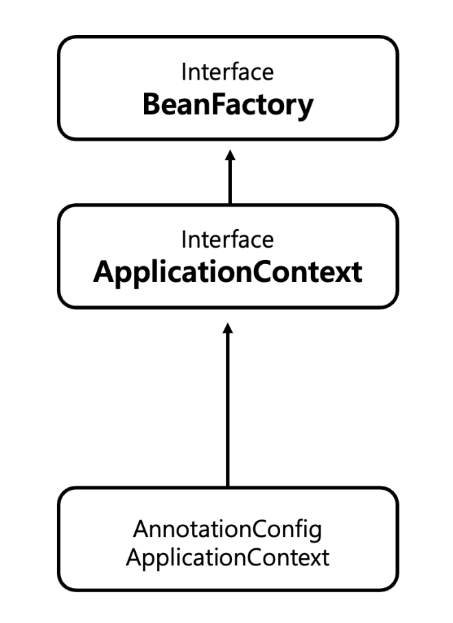

# 스프링 컨테이너

- `ApplicationContext` == 스프링 컨테이너(인터페이스)
- `@Configuration`이 붙은 클래스에서 `@Bean`이라 적힌 메서드를 모두 호출해서 반환된 객체를 스프링 컨테이너에 등록한다.
- 스프링 빈 : 스프링 컨테이너에 등록된 객체
  - `@Bean`이 붙은 메서드 명을 스프링 빈의 이름으로 사용한다.
  - `applicationContext.getBean()`메서드를 사용해 찾을 수 있다.

```java
@Configuration
public class AppConfig {

    @Bean
    public MemberService memberService() {
        return new MemberServiceImpl(memberRepository());
    }
```

```java
ApplicationContext applicationContext = new AnnotationConfigApplicationContext(AppConfig.class);
MemberService memberService = applicationContext.getBean("memberService", MemberService.class);
OrderService orderService = applicationContext.getBean("orderService", OrderService.class);
```

## 스프링 컨테이너 생성 과정

- `ApplicationContext` == 스프링 컨테이너(인터페이스)
- XML 기반, 애노테이션 기반의 자바 설정 클래스로 만들 수 있다.
- `new AnnotationConfigApplicationContext(AppConfig.class)` ➡️ `ApplicationContext` 인터페이스의 구현체

- `BeanFactory`도 있지만,
- 일반적으로 `ApplicationContext`를 스프링 컨테이너라고 한다.

## BeanFactory, ApplicationContext



### BeanFactory

- 스프링 컨테이너의 최상위 인터페이스
- 스프링 빈을 관리하고 조회하는 역할
- `getBean()` 제공
- 직접 사용할 일은 거의 없다.

### ApplicationContext

- BeanFactory 기능을 모두 상속 받아서 제공
- 관리하고 조회하는 기능 외의 부가 기능 제공
  - 메시지소스를 활용한 국제화 기능 : `MessageSource`
    - 한국에서 들어오면 한국어, 영어권에서 들어오면 영어 출력
  - 환경변수
    - 로컬, 개발, 운영 등을 구분해서 처리
  - 애플리케이션 이벤트
    - 이벤트 발행 구독 모델 지원
  - 편안한 리소스 조회
    - 파일, 클래스패스, 외부 등에서 리소스 편리하게 조회

## XML 설정 사용

- 스프링 부트를 많이 사용하며 XML 기반 설정은 잘 사용하지 않는다.
- 컴파일 없이 빈 설정 정보를 변경할 수 있다.
- `GenericXmlApplicationContext`를 사용하면서 `xml` 설정 파일을 넘기면된다.

```xml
<?xml version="1.0" encoding="UTF-8"?>
<beans xmlns="http://www.springframework.org/schema/beans"
       xmlns:xsi="http://www.w3.org/2001/XMLSchema-instance"
       xsi:schemaLocation="http://www.springframework.org/schema/beans http://www.springframework.org/schema/beans/spring-beans.xsd">

    <bean id="memberService" class="hello.core.member.MemberServiceImpl">
        <constructor-arg name="memberRepository" ref="memberRepository"/>
    </bean>

    <bean id="memberRepository" class="hello.core.member.MemoryMemberRepository"/>
</beans>
```

```java
ApplicationContext ac = new GenericXmlApplicationContext("appConfig.xml");
```
